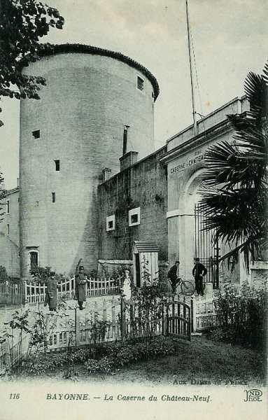

# Parcours du 49e R.I. (Bayonne)

En 1914, le régiment fait partie de la 71e brigade (général Dion), 36e division (général Jouannic) et 18e C.A. (général de Mas Latrie). Il est commandé par le colonel Burgalat.

_Bayonne : caserne du Château-Neuf_
_Collection privée_

### 7 août :

Le régiment est mis en route par chemin de fer sur Bricon.

### 8 août :

Le 49e R.I. arrive à Barisey-la-Côte.

### 9 - 10 août :

Le régiment cantonne à Mont-le-Vignoble.

### 11 août :

Le 3e bataillon quitte Mont-le-Vignoble pour se rendre à Crezilles, avec un groupe du 36e R.A.C.

### 12 août :

Le régiment se met en marche vers Toul et prend ses cantonnements à Royaumeix.

### 13 août :

Le 49e R.I. quitte Royaumeix et van cantonner à Grosrouvres.

### 14 août :

Le régiment quitte Grosrouvres et se porte à Bernécourt.

### 15 août :

Le 49e R.I. cantonne à Bernécourt.

### 16 août :

Le régiment se rend à Lay-Saint-Remy.

### 17 août :

Le 49e R.I. reste cantonner à Lay-Saint-Remy.

### 18 août :

Le régiment se rend à la gare de Pagny-sur-Meuse où il est transféré par voie ferrée vers Fourmies. Il fait désormais partie de la Ve armée.

### 19 août :

Départ de Fourmies et arrivée à Sivry (Belgique). Cantonnement à Sivry et Eppe-Sauvage.

### 20 août :

Cantonnement à Hestrud.

### 21 août :

Le régiment quitte Hestrud pour Biesme-sous-Thuin, Heuleu et Gozée.

### 22 août :

- Le 1e bataillon organise défensivement le front du carrefour 400 m à l’est du chemin de Le Chêne jusqu’au chemin formant la limite ouest de Gozée, jouxtant à droite le 34e R.I.

- Le 3e bataillon organise défensivement le village de Gozée, ayant à sa disposition deux sections de mitrailleuses.

- Le 2e bataillon est en réserve au nord de Biesme-sous-Thuin (ferme Heumon).

Les 11e et 12e sections sont mises à la disposition du 10e régiment de hussards qui opère au nord de la Sambre, dans la région de Landelies.

- Une section au pont de la Jambe de Bois, 2 km au nord-est de Landelies.
  Trois sections à Landelies.
  Une section au pont de l’ancienne abbaye d’Aulne.
  Trois sections gardant les ponts dans la région de Landelies.

Des groupes de fantassins allemands sont aperçus. Les compagnies ouvrent le feu et les allemands se replient.

### 23 août : combat de Gozée

Le 49e R.I. occupe défensivement la position de Gozée, sur un front de près de 2 km. Le 3e bataillon a organisé défensivement le village.

- Les 9e et 10e compagnies sont en première ligne et défendent la lisière nord du village.
  Les 11e et 12e sont sur une position de repli à la lisière sud.
  La route de Charleroi - Beaumont est enfilée par une section de mitrailleuses.
  Une section de mitrailleuses appuie la gauche de la 10e compagnie.
  Le 2e bataillon est en réserve à la ferme Henrion.

A 9h30, l’artillerie allemande commence à tirer sur les tranchées occupées par la 3e compagnie. En même temps, de petites colonnes d’infanterie débouchent du pont de la Sambre, sur la route de Gozée. Les premiers éléments sont rapidement fauchés par les mitrailleuses, mais il arrive des forces plus considérables qui, petit à petit s’écoulent sur la gauche du village, s’avançant vers les tranchées défendues par la 10e compagnie etune section de mitrailleuses.

D’autres fractions, qui ont passé la Sambre au pont de Landelies, et qui s’étaient rassemblées dans les bois de la rive droite, débouchent en face des retranchements défendus par les 2e et 3e compagnies.

La section de mitrailleuses est obligée de se retirer et son absence crée un vide dans la ligne. Bientôt, la 10e compagnie, dont la gauche va être débordée, suit le mouvement et perd deux officiers et une dizaine d’hommes. L’autre section de mitrailleuses est également obligée de se replier.

Le 3e bataillon, dont la gauche est débordée, se replie dans les bois au sud de Gozée. Ordre est donné à une compagnie de se porter en avant et de ramener le 3e bataillon à l’attaque de Gozée. Ce mouvement réussit et à 17h, le 49e R.I. est à nouveau maître de la localité.

La 8e compagnie est prise à partie par l’artillerie, l’infanterie allemandes et par des mitrailleuses qui la prennent en enfilade. Elle est presque anéantie.

A 18h, le mouvement allemand progresse, des masses considérables menacent la ligne de défense. Le 3e bataillon est obligé d’évacuer Gozée. La droite, abandonnée par le 18e R.I., est à découvert. La gauche est également intenable, le 34e R.I. s’étant retiré.

A 18h30 parvient l’ordre de retraite, qui s’effectue sous la protection de l’artillerie. Les allemands ne poursuivent pas et le régiment se retire vers Ragnies. Il a perdu 13 officiers et 883 sous-officiers, caporaux et soldats.

### 24 août :

Le 49e R.I. cantonne à Vergnies.

### 25 août :

Cantonnement au Cheval Blanc, Le Quesne, Le Crochet.

### 26 août :

Cantonnement près de Nouvion.

### 27 août :

Le régiment se rend à Voulpaix à 17h et quitte la localité le 28 à 06h.

### 28 août :

Le régiment marche vers l’ouest et se porte à 1 km de Landouzy, puis se dirige sur Vervins qu’il traverse à 16h. Il cantonne à Cambron, Saint-Pierre et Lanneux-du-Gard.

### 29 août : bataille de Guise

Le régiment arrive à Séry-lès-Mézières. Le 2e bataillon doit attaquer Homblières, encadré à gauche par le 1e bataillon et à droite par le 34e R.I. Le 3e bataillon est en réserve. A gauche du 1e bataillon, il y a un bataillon du 18e R.I. opérant avec les troupes anglaises.

La 2e compagnie trouve la ferme de Lorival inoccupée et tient ce point d’appui. Le 2e bataillon s’établit à hauteur de la ferme Cambrie. Des patrouilles signalent des troupes allemandes à Itancourt et vers Mesnil-Saint-Laurent et le combat s’engage. L’artillerie appuie l’infanterie.

A 10h30, les abords de la ferme de Lorival sont arrosés par l’artillerie allemande et l’infanterie allemande marche vers la ferme. Les 1e et 2e bataillons tentent à deux reprises d’arrêter la marche de l’infanterie mais le feu de l’artillerie et les mitrailleuses occasionnent un retrait.

Les Français doivent se retirer vers la ferme de Lorival, devant les 7e, 28e et 78e régiments saxons et les 73e, 82e et 92e infanterie-Regimente. L’ordre est donné de se replier à 600 m au sud de la ferme de Lorival.

A 14h30, les bois au sud de la ferme de Cambrie sont repris.

A 15h30, le régiment se réunit à Surfontaine, après avoir repoussé les attaques de six régiments allemands. Il a perdu 18 tués, 180 blessés et 188 disparus.

### 30 août :

Arrivée à Montceau-les-Loups.

### 31 août :

Arrivée à Cerny-lès-Bussy.

### 1 septembre :

Le régiment arrive à Courcelles.

### 2 septembre :

Le 49e R.I. quitte Courcelles vers 13h et arrive à Sergy.

### 3 septembre :

A 03h, le régiment part de Sergy et s’établit face à Courboin quand une violente attaque par surprise, débouchant du nord de Courboin, se produit. La surprise est telle qu’elle provoque un début de panique.

Un certain nombre d’hommes appartenant aux 1e et 2e bataillons vont occuper une position de repli, qui permet aux fractions restées sur le front de se replier.

Le soir, les 1e et 2e bataillons se retrouvent dans la direction de Montmirail. Le reste se reconstitue à Montigny.

### 4 septembre :

Le régiment, après avoir bivouaqué à l’ouest de Montigny, repart vers 02h et se rend à Ginbois, puis bivouaque près de la ferme Potier.

### 5 septembre :

Le 49e R.I. part de Ginbois et bivouaque au Plessis-Poil-de-Chien.

### 6 septembre : début de l’offensive

Le régiment reçoit l’ordre verbal du commandant de la 71e brigade d’organiser défensivement une position sur la croupe sud-ouest de Voulton et de se relier au 249e R.I., mais à 05h30, il est ramené au bivouac.

A 06, le 49e R.I. entre dans le dispositif de marche de la 36e division et se porte au nord du Plessis.

A 13h30, le régiment continue son mouvement vers le nord par l’est de Voulton. A17h15, le régiment doit se porter sur Voulton, en réserve de la 36e division. Il se prépare à une attaque allemande sur Savigny puis bivouaque à Voulton.

### 7 septembre :

Le 49e R.I. reçoit l’ordre de se porter au nord de Coeffrin et au nord-est de Rupéreux. Le soir, il s’arrête à Marchais où il bivouaque.

### 8 septembre :

Le régiment marche dans la colonne de la 36e division et reçoit l’ordre de se porter sur Vendières, à gauche du 34e R.I., afin de participer à une contre-attaque dans la région de Marchais. Il part à l’attaque à 15h et occupe la ferme de Bois Jean à 16h30, en se reliant au 36e R.I.

Le progrès des 2e et 3e bataillons est contrarié par l’artillerie allemande. A l’ouest de la cote 182, ils sont reçus par des feux d’infanterie et de mitrailleuses.

A 19h30, les deux bataillons donnent l’assaut qui leur fait  conquérir un terrain semé de tranchées jusqu’à la route nationale à hauteur de La Meulière.

Le combat de Marchais a coûté au régiment 22 morts, 103 blessés et 70 disparus.

### 9 septembre :

Le régiment entre à 9h30 à La Haute-Epine et il bivouaque le soir à Villers-Chamblon.

### 10 septembre :

Bivouac à Vaux.

### 11 septembre :

Bivouac à Villers-sur-Fère.

### 12 septembre :

Le régiment n’est pas engagé et cantonne à Unchair.

### 13 septembre :

Cantonnement au nord de Beaurieux.

### 14 septembre :

Le régiment passe la journée dans les bois de Beaurieux, le 34e poursuivant seul l’attaque.

A 22h, le régiment se dirige vers Craonnelle. Les 1e et 2e bataillons occupent les crêtes au nord de Craonne.

### 15 septembre :

Le 1e bataillon s’établit sur les crêtes à l’ouest de Craonne et reçoit une canonnade incessante. Le nouveau commandant du régiment est le commandant Legros. A la nuit, le régiment reçoit l’ordre de se replier sur Craonnelle.

### 16 septembre :

Les 2e et 3e bataillons occupent les tranchées au moulin de Vauclerc et à Craonnelle. Seules les artilleries sont en action.

### 17 septembre :

La situation reste inchangée. Le duel d’artillerie redouble d’intensité. L’aménagement des tranchées se poursuit.

### 18 septembre :

La guerre s’enlise dans les tranchées.