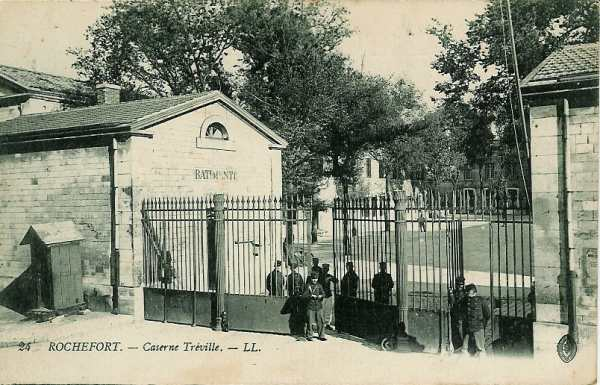
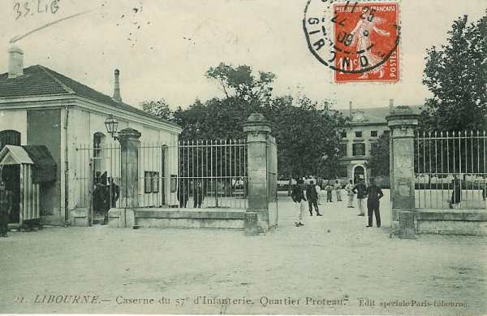

# Parcours du 57e R.I. (Rochefort, Libourne)

En 1914, le régiment fait partie de la 70e brigade (général Pierron), 70e division (général Exelmans) et 18e C.A. (général de Mas Latrie). Il est commandé par le colonel Dapoigny.

_Rochefort : caserne Tréville_
_Collection privée_

_Libourne : quartier Proteau_
_Collection privée_

### 6 août :

Le régiment embarque en chemin de fer à Rochefort et suit l’itinéraire Niort, Thouars, Saumur, Tours, Orléans, Montargis, Bar-sur-Aube, Troyes, Neufchâteau, Bricon (gare régulatrice). Il est ensuite dirigé vers Maxey-sur Vaise (Meuse).

Le 1e bataillon quitte Libourne via Angoulême, Poitiers, Tours.

### 7 août :

C’est la fin du débarquement du régiment. Celui-ci se dirige vers son cantonnement de concentration de Montbras - Taillancourt - Sauvigny.

### 8 août :

A 07h, le 1e bataillon est dirigé sur Montbras. Le Q.G. du C.A. est à Coussey.

### 9 - 10 août :

L’ordre d’opérations n° 1 parvient à 04h. Le 18e C.A. doit se constituer par divisions accolées, au sud de la ligne Vaucouleurs -  Blenod-lès-Toul. Le 57e R.I. suit l’itinéraire Montbras, Pagny-la-Blanche-Côte, Vannes-le-Châtel. Il cantonne à  Allamps,  Housselmont, Vannes-le-Châtel, Saulxures-lès-Vannes.

### 11 août :

La 18e C.A. fait un mouvement vers le nord en se portant dans la direction de Pont-Saint-Vincent. Le 57e R.I. quitte ses cantonnements d’Allamps et d’Housselmont à 04h30 et marche via Allain, Thuilley-aux-Groseilles, Maizières, Bainville-sur-Madon et cantonne à Viterne. L’E.M. du 18e C.A. est à Colombey-les-Belles.

### 12 août :

Le 18e C.A. marche, la 35e division à droite par Marson et Gondreville-sur-Moselle, la 36e division vers Toul.

### 13 août :

Le C.A. continue son mouvement vers le nord. La 35e division doit se porter vers Manonviller, Royaumeix, Ménil-la-Tour, la 36e marchant par Gondreville, Fontenay, Villiers-Saint-Etienne, Avrainville, Manoncourt, Tremblecourt.

A 04h, le 3e bataillon quitte Rogéville pour aller occuper Rosières-en-Haye et garder un dépôt de munitions.

### 14 août :

Les Ie et IIe armées se portent en avant et le 18e C.A. est en réserve aux environs de Domèvre-en-Haye. Deux compagnies sont détachées vers les ponts de Griscourt et de Gézoncourt.

### 15 août :

Les compagnies de Griscourt et de Gézoncourt restent sur place. Une compagnie du 2e bataillon reste à Rogéville pour défendre le village.

### 16 août :

Le 18e C.A. est maintenu en réserve de groupe d’armées. A 03h, parvient l’ordre de se tenir prêt à partir.

### 17 août :

La 70e brigade quitte ses cantonnements pour se porter dans la région de Royaumeix, Andilly, Ménil-la-Tour.

### 18 août :

Le régiment quitte ses cantonnements et se rend à Pagny-sur-Meuse. A 18h40, le train quitte Pagny et suit l’itinéraire Commercy, Bar-le-Duc, Sainte-Ménehould, Amagne, Lucquy, Hirson. Le 2e élément est dirigé vers Fourmies et le 3e vers Pagny.

### 19 août :

Le régiment se dirige vers Liessies où il cantonne.

### 20 août :

Même cantonnement. Le Q.G. du C.A. est à Solre-le-Château et l’E.M. de la division à Liessies.

### 21 août :

Le 18e C.A. est encadré par le 3e C.A. à droite et par la cavalerie anglaise à gauche. Il se forme par colonne de division, la 36e en tête entre Thuin et Thirimont et la 35e entre Beaumont et Cousolre, en suivant l’itinéraire Liessies, Solre-le-Château, Hestrud. Les troupes françaises sont chaleureusement accueillies par la population et vont cantonner à Bousignies, Cousolre et Beaumont.

### 22 août :

A 13h, le régiment reçoit l’ordre de quitter ses cantonnements de Bousignies-sur-Roc et de Cousolre pour aller cantonner à Montignies-Saint-Christophe et Thirimont avec le 144e R.I.

Vers 17h, la présence allemande est signalée à Binche et à Anderlues. Les dispositions sont prises :

- Deux compagnies du 1e bataillon, gardant le secteur entre la route de Montignies à Mons et celle de Sartiau à Thuin.
  Le 3e bataillon en cantonnement d’alerte dans le village de Bousignies, prêt à occuper la lisière nord du village.

Vers 21h, le 3e bataillon reçoit l’ordre d’aller faire occuper les ponts de la Sambre, de Merbes-le-Château, La Buissière et Fontaine-Valmont.

A 04h, le régiment prend les armes pour se porter

- Le 1e bataillon au bois de Fontaine-Valmont
  Le 2e bataillon en rassemblement à la lisière nord du bois de Leers-et-Fosteau, en contact avec le 144e R.I.

### 23 août :

La matinée se passe sans incident sauf une violente canonnade du côté de Thuin et de Lobbes. Dans l’après-midi, la canonnade s’étend vers Fontaine-Valmont et La Buissière.

A 14h, la 70e brigade reçoit l’ordre de se porter sur Lobbes pour être en situation d’empêcher toute offensive allemande sur la rive gauche de la Sambre. La 70e brigade se porte en avant avec comme axe de marche la route de Leers-et-Fosteau. La marche sur Lobbes se fait sans perte sous un feu violent d’artillerie.

L’attaque des positions allemandes est courte et violente. L’assaut est donné par trois compagnies mais l’élan est brisé par une haie et une maisonnette. En moins de cinq minutes le 5e compagnie perd la moitié de son effectif. Devant ces pertes sévères et les difficultés du terrain, il faut battre en retraite.

Les Allemands lancent une contre-attaque sous forme d’un mouvement enveloppant qui prend les tirailleurs de flanc. Une compagnie de mitrailleuses française met ses pièces en batterie et, par un tir bien ajusté, couche par terre les rangs allemands à mesure qu’ils apparaissent sur la crête. Les Allemands subissent des pertes très fortes et leur élan est à leur tour brisé.

Le régiment se reforme et, par Sartiau, gagne Beaumont où il cantonne. Les 1e et 3e bataillons et la 8e compagnie sont restés à Fontaine-Valmont et à Montigny-Saint-Christophe.

### 24 août :

La 70e brigade se porte au bois de Fontaine-Valmont et à l’ouest de la grand’ route sur des positions préparées, mais, écrasée par le tir de l’artillerie allemande, elle reçoit l’ordre de se retirer sur la croupe Sartiau - Malaise. A la nuit, le 57e R.I. et l’E.M. de la 70e brigade se portent à Felleries où ils cantonnent.

### 25 août :

Continuation de la marche vers le sud. Le 57e forme l’arrière-garde de la brigade et se porte par Solre-le-Château, Beugnies sur Bas-Lieu et Flaumont. Le 3e bataillon tient le front entre les routes de Maubeuge et d’Avesnes. Quelques cavaliers allemands s’approchent trop et sont décimés.

### 26 août :

Le 18e C.A. se porte vers le sud-ouest à la point du jour, la 70e brigade par la route de Paris jusqu’au Cheval Blanc puis par Boulogne sur Cartignies en vue de couvrir le repli de la 69e division de réserve.
Le régiment va s’établir au sud de Cartignies puis se transporte sur les croupes de la Rivierette, entre Beaurepaire et Les Zones.

### 27 août :

A 22H, la brigade a reçu l’ordre de se porter sur Nouvion, où elle arrive à 02h. A 04h, le 18e C.A. se porte sur la rive sud de l’Oise. La 70e brigade passe par Leschelle, Chigny, Gomont. Le 1e bataillon, qui n’a pu être joint, est talonné par une D.C. allemande et rejoint le reste du régiment pendant la nuit.

### 28 août :

La 35e division doit se porter dans la région de Plaine Selve - Parpeville sous la protection du 144e R.I., établi à Marly. Le 57e R.I. suit l’itinéraire La Vallée-aux-Blés, Sains-Richaumont, Le Hérie-la-Viéville, Landifay, Bertaignemont, ferme de Torcy. A hauteur de Le Hérie-la-Viéville, une canonnade se fait entendre vers Guise.  Le général de division décide d’aller soutenir les 24e et 28e R.I.

Le régiment se porte sur Guise, sa droite suivant la grand’ route de Le Hérie à Guise. Le 2e bataillon est engagé mais est arrêté par une terrible fusillade. Le régiment est à 5 - 600 m  de Guise. La nuit approche et le feu est toujours aussi intense. L’artillerie française, très éprouvée, n’aide l’infanterie que faiblement. Le général de division donne l’ordre de rompre le combat. A minuit, le régiment cantonne à Parpeville.

### 29 août : bataille de Guise

La Ve armée doit attaquer vers le nord-ouest, le 18e C.A. vers Homblières et Marey. A 06h, le régiment se rassemble dans le vallonnement de Parpeville face à l’ouest. A 10h, il reçoit l’ordre de se porter sur Ribémont en réserve de C.A. et à 20h, il reprend ses cantonnements à Parpeville.

### 30 août :

La Ve armée doit rejeter les Allemands sur l’Oise, la 35e division est orientée vers Origny à 11h25. Le 57e R.I. a un bataillon sur la croupe qui descend vers Origny-Sainte-Benoîte. Les autres bataillons se rassemblent à 800 m  de Pleine-Selve.

A 08h15, la brigade se met en marche sur le signal d’Origny, mais, à 11h25, elle reçoit l’ordre de se replier sur des positions préparées en avant de Villers-le-Sec et de Pleine-Selve. A 14h, la position est devenue intenable sous le feu de l’artillerie allemande. La brigade se replie vers Villers-le-Sec où elle doit tenir jusqu’à l’arrivée du 3e C.A. à sa hauteur.

La brigade modifie sa position sous un feu intense. Vers 20h, la brigade se porte vers Surfontaine et Fay-le-Noyer, puis à Chevresis-la-Ferté et Chevresis-aux-Dames.

### 31 août :

A 06h50, la brigade atteint Chevresis-aux-Dames, Mesbricourt, Chery-lès-Douilly, Aulnois-sous-Laon. A 08h, le 3e bataillon se porte vers Catillon-du-Temple pour protéger l’écoulement de la 3e D.I.

A 18h30, la brigade reprend sa marche par Besny, Cerny-lès-Bucy, Mons-en-Laonnois et stationne dans la région de Bourguignon-sous-Montbavin et Royaucourt.

### 1 septembre :

La brigade se porte sur Paars, y stationne quelques heures puis reprend sa marche.

### 2 septembre :

Le 57e R.I. suit l’itinéraire Bazoches, Mont-Notre-Dame, Bruys, Mareuil-en-Dôle, Nesles, Sergy, Cierges. Il stationne en fin de marche vers Champvoisy.

### 3 septembre :

Le 18e C.A. doit se porter au sud de la Marne par La Chapelle-Hurlet, Vincelles, Chassins, pont de Dormans, Chavenay, La Chapelle, Monthodon, Beaulne, Verdon et Pargny. Le 144e couvre le passage de la Marne. Des cavaliers allemands lancés à la poursuite sont accueillis par des coups de fusil.

### 4 septembre :

Le régiment se reporte vers Montmirail. Le passage de la localité se fait très rapidement car l’artillerie allemande couvre les ponts de projectiles. A 18h, le cantonnement a lieu à Tréfols. Le colonel Dapoigny, souffrant, est remplacé par le colonel Debeugny.

### 5 septembre :

Le mouvement de retraite continue vers le sud-ouest par Le Vezier, Villeneuve-la-Lionne, Le Bois Frais, Fermes des Pothiers, Vaulevrault, Toulotte, Sancy.

De Sancy, la brigade se porte sur Rupereux par Brantilly et Coeffrin. La brigade se rassemble au sud du chemin conduisant de Rupereux au château de Flaix, prête à se porter en avant, le 57e R.I. entre Rupereux et le chemin de Coeffrin - ferme de Saint-Barthélémy. Des tranchées sont construites pendant la nuit. Le 57e R.I. est en cantonnement d’alerte à Rupereux et à Voulton.

### 6 septembre : début de l’offensive

Le général de Maud’huy prend le commandement du 18e C.A. et le général Marjoulet celui de la 35e division. L’axe d’attaque du 18e C.A. est Montmirail. La 35e D.I. opère entre Villiers-Saint-Georges, le château de Flaix, Sancy, Saint-Martin. La brigade remonte vers le nord en marchant par bonds. Le régiment traverse Villiers-Saint-Georges que les Allemands viennent de quitter, et y bivouaque.

### 7 septembre :

L’offensive se poursuit en pivotant vers Montceau-lès-Provins. Vers 14h, le régiment traverse la localité et suit les traces des Allemands par Saint-Martin-du-Boschet où il bivouaque.

### 8 septembre :

La poursuite continue via Saint-Martin-du-Boschet, Meilleray, Montolivet, Vendières, Fontenelle. Après un long stationnement à hauteur de Villeneuve-la-Lionne, le 57e R.I. se porte par Le Vézier vers la ferme Thelouet.

Vers 16h, le régiment reçoit l’ordre de se porter rapidement sur la rive nord du Petit Morin. Pour éviter trop de pertes dues à l’artillerie, le régiment prend un itinéraire défilé. Arrivé à la rivière, le feu de l’artillerie allemande cesse et le régiment poursuit vers La Celle-sous-Montmirail. Dans la nuit, les Allemands entreprennent un retour offensif contre le 144e R.I.

### 9 septembre :

La poursuite continue vers Viffort, 36e et 38e D.I. en première ligne. La 35e D.I. se forme en rassemblement articulé vers l’Epine-aux-Bois. Le soir, le régiment cantonne à Rozoy-Bellevalle.

### 10 septembre :

Le régiment reçoit un renfort de 477 hommes. La Ve armée continue son mouvement vers Château-Thierry. Le 57e R.I. part de Rozoy et se porte par Fontenelle vers le nord-ouest. Il cantonne à Château-Thierry.

### 11 septembre :

Continuation de la poursuite. Le 18e C.A. se dirige vers Vailly. La 35e division fait mouvement via Brasles, Epieds, Coincy, Bruyères, Trugny, Cramaille. Ensuite, le C.A. oblique vers le nord-est et passe par Beuvardes, Ville-Moyenne, Villiers-sur-Fère et va cantonner à Sergy.

### 12 septembre :

L’offensive se poursuit vers le nord-est par Mareuil, Chery, Saint-Gilles, en vue de passer la Vesle. En arrivant à hauteur de Mont-Saint-Martin, on entend le canon vers Fismes. Couvert par l’artillerie, le régiment se porte sur Unchair et Breuil, pour aller ensuite cantonner à Montigny-sur-Vesle.

### 13 septembre :

Le mouvement continue vers Château-Porcien, le 57e R.I. en tête de la 35e division, par Courlandon, Romain, Ventelay, Roucy, Pontavert, Juvincourt.  Au-delà de Juvincourt, la présence allemande est signalée sur les hauteurs de Craonne, dans le bois de Chevreux et à Corbeny. Le 1e bataillon est chargé d’attaquer Corbeny. La localité est enlevée et le régiment s’installe à  la lisière nord.

### 14 septembre :

Le 57e R.I. tient Corbeny, le 144e R.I. Craonne. Dès le matin, les Allemands ouvrent une violente canonnade sur Corbeny, suivie d’une attaque d’infanterie. Le régiment offre une résistance acharnée et subit de grosses pertes. Vers 13h, menacé sur sa droite, le régiment doit abandonner Corbeny et se retirer vers La Ville-aux-Bois.

### 15 septembre :

Dès le matin, violente canonnade  suivie d’une attaque d’infanterie. Vers 11h, quelques unités commencent un mouvement de repli, aussitôt arrêté par le général Pierson et le colonel Debeugny.

### 16 septembre :

Le 18e R.I. attaque La Ville-aux-Bois. Comme les Saxons ont fortifié le village, il faut le conquérir pied à pied. En fin de journée, le 1e bataillon ne compte plus que 300 hommes.

### 17 septembre :

Le régiment tient toute la journée sous une grêle d’obus et occupe des tranchées.

### 18 septembre :

La situation reste de même. Les obus continuent à pleuvoir sur le régiment.
Le 21 septembre, le régiment sera cité à l’ordre du corps d’armée.