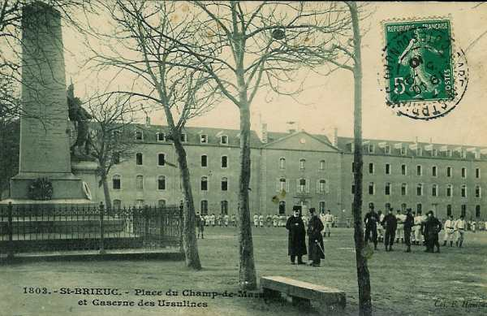

# Parcours du 71e R.I. (Saint-Brieuc)

En 1914, le régiment fait partie de la 37e brigade (général Pierson), 19e division (général Bailly) et 10e C.A. (général Defforges). Il est commandé par le colonel Bonnefoy.

_Saint-Brieuc : caserne des Ursulines_
_Collection privée_

### 5 août :

Le régiment s’embarque à Saint-Brieuc.

### 6 août :

Le 1e échelon arrive à Attigny à 18h23. Le 1e bataillon et une section de mitrailleuses reçoivent l’ordre de tenir les ponts sur la Meuse à Remilly et à Bazeilles. Le 2e bataillon cantonne à Attigny et le 3e à Ballay et Toges.

### 7 août :

Le 2e bataillon et l’Etat-Major vont cantonner à Quatre-Champs, après une étape de 13 km.

### 8 août :

Le régiment reçoit l’ordre d’aller cantonner à Vandy et à Vrizy.

### 9 août :

Les éclaireurs (13e régiment de hussards) rejoignent le régiment à Quatre-Champs.

### 10  - 11 août :

L’E.M., les 2e et 3e bataillons quittent leurs cantonnements pour se rendre à Vivier et à Bulson.

### 12 août :

Le régiment reçoit l’ordre de partir le lendemain.

### 13 - 14 août :

Le 71e R.I. va occuper Omont et Chagny-lès-Omont.

### 15 août :

Le régiment reçoit l’ordre de se tenir prêt à partir. L’E.M. et les 2e et 3e bataillons se rendent à Villers-le-Tilleul, le 2e bataillon restant à Omont.

### 16 août :

Le C.A. se porte vers le nord en deux colonnes. Le soir, le 71e R.I. cantonne à Sormonne, à Wartigny, à Bolmont et à Hardoncelle.

### 17 août :

Le 10e C.A. poursuit son mouvement vers le nord. Le soir, il cantonne à L’Escallière et Regniowez

### 18 août :

Le C.A. poursuit vers le nord. Le régiment pénètre en territoire belge et cantonne à Baileux.

### 19 août :

La brigade d’avant-garde se porte sur Mettet. Tout le régiment cantonne à Florennes.

### 20 août :

Le 10e C.A. progresse légèrement vers le nord. Le 71e R.I. cantonne à Mettet et à Biesmerée. Une compagnie reste à Florennes pour assurer la garde du Q.G. du C.A.

### 21 août :

Aucune information.

### 22 août :

Le régiment se rassemble derrière un bois sur la route de Mettet, à l’ouest de Haut-Vent. A 18h, il reçoit l’ordre d’organiser une position sur la route de Fosse à Arsimont, puis il reçoit un nouvel ordre : se porter entre Vitrival et Le Roux pour occuper une position de repli. Le Roux est déjà occupé par les Allemands et le régiment bivouaque près de Mettet.

### 23 août :

Le 71e R.I. reçoit l’ordre de prendre position entre Biesmerée et Ermeton, face au nord-ouest.

### 24 août :

Le régiment quitte ses positions vers 04h pour se rendre à Gonrieux et à Boutonville.

### 25 août :

Le 71e R.I. marche par Baileux, Bourlers, Séloignes, Neuville-aux-Joûtes.

### 26 août :

Le 37e brigade reçoit l’ordre d’occuper la position Hirson - Blissy face au nord afin de contenir les Allemands.

### 27 août :

Le 71e R.I. marche par la ferme Rainette, Bucilly, Landouzy-la-Ville. Le régiment tient les débouchés du Thon, le 1e bataillon à Bucilly, le 2e à Eparcy, le 3e à La Hérie.

### 28 août :

Le régiment cantonne à Saint-Pierre.

### 29 août : bataille de Guise

Le 71e R.I. fait mouvement à 05h vers Les Bouleaux, Lemé et Le Sourd. Les Allemands sont signalés vers Le Sourd et le régiment prend sa formation de combat.

A 10h, Le Sourd est occupé par le 2e bataillon. A 11h, une canonnade sur la lisière de Le Sourd rejette le bataillon à la lisière sud. Un mouvement enveloppant allemand oblige à évacuer la localité. Le 3e bataillon est engagé vers la cote 174, le 1e bataillon à la lisière nord de Lemé.

Vers 12h, les Allemands progressent  mais une contre-attaque menée par le général Bailly rejette les Allemands dans Le Sourd et les poursuit jusqu’à la route Wiège - Faty. Le régiment se replie ensuite vers Marle pour se reconstituer.

### 30 août :

Le régiment cantonne à Marle. Le colonel Bonnefoy ayant pris le commandement de la brigade est remplacé par le lieutenant-colonel Bonaire.

### 31 août :

Le régiment fait étape à Marle et reçoit un renfort de 500 hommes.

### 1 septembre :

Une marche de nuit conduit le régiment à Villers-Franqueux.

### 2 septembre :

Le régiment quitte son cantonnement à 05h et parvient à Gueux.

### 3 septembre :

Le 71e R.I. cantonne à Hautvillers.

### 4 septembre :

Le régiment fait route vers Courjeonnet par Epernay et Chaltrait.

### 5 septembre :

Départ de Courjeonnet à 04h. Etape à Launoit, les 2e et 3e bataillons cantonnant à Beauvais.

### 6 septembre : début de l’offensive

Le régiment se place dans le rassemblement de la 37e brigade à Mœurs. A la fin de la journée, un bataillon reçoit l’ordre d’occuper L’Hermite mais il y est accueilli par des coups de feu. Le 3e bataillon occupe la ferme Guébarré.

### 7 septembre :

La ferme de Guébarré est mise en état de défense. Le 3e bataillon s’y maintient jusqu’à midi sous le feu de l’artillerie allemande.  Après 14h, le régiment entame la poursuite en deux colonnes, l’une  par L’Hermite vers Jouy et l’autre par Le Chatelet vers le Château de Désiré.

### 8 septembre :

Le régiment quitte ses bivouacs à 06h et se dirige vers Soigny par Le Recoude. A 15h, le 71e continue sa progression vers Boissy. A la nuit tombante, les 6e et 7e compagnies occupent la localité. A 10h, le régiment reçoit l’ordre de s’emparer du pont du Petit Morin, qui s’avère non défendu. La journée a coûté au régiment 15 tués, 102 blessés et 24 disparus.

### 9 septembre :

Au lever du jour, la 7e compagnie surprend un convoi de munitions allemand. La compagnie ouvre le feu et s’en empare. Le reste du régiment débouche de Boissy-le-Repos à 07h et se dirige vers Fontaine-au-Bron.

A 17h, le régiment se reforme pour se rendre par une marche de nuit à la ferme Le Bouc-aux-Pierres, à 3 km à l’ouest de Champaubert (03h).
Le régiment a perdu dans la journée 15 tués et 70 blessés.

### 10 septembre :

Le 71e R.I. se dirige par Champaubert sur Etoges où il cantonne.

### 11 septembre :

Les 1e et 2e bataillons passent la Marne et vont bivouaquer à la lisière nord de Damery, le 3e bataillon à Vauciennes.

### 12 septembre :

Le régiment se ressoude à Damery après passage de la Marne sur un pont de bateaux. Il poursuit les Allemands de Damery à Sermiers. La route est parsemée de bouteilles et de tonneaux vides.

### 13 septembre :

Etape de Sermiers à Cormontreuil pour cantonner à Trois-Puits.

### 14 septembre :

Départ pour Prunay, 1 km au sud du château de Romont. Le régiment est en réserve derrière le 48e R.I. et la division marocaine.

### 15 septembre :

Le 71e R.I. stationne à Prunay jusqu’à 13h puis est affecté à la 20e division.

### 16 septembre :

A 20h30, le régiment est mis en marche vers Montbré où il arrive à 02h le 17 août. Le bivouac dure de 02h à 07h.

### 17 septembre :

A 11h, le 71e R.I. reçoit l’ordre de se rendre à Bezannes où il arrive sous la pluie puis il doit se rendre à Reims. Le 1e bataillon est envoyé à Beteheny et est engagé dans une action de nuit.

### 18 septembre :

Le 2e bataillon part en soutien d’artillerie à Fismes mais, en cours de nuit, est dirigé vers Mâco et Merfy, faisant face au fort de Brimont. Les 1e et 3e bataillons sont dirigés sur Maison-Blanche et le 3e bataillon vers la ferme du Luxembourg.

### 19 septembre :

Le 2e bataillon prend une position de réserve sur les rives du canal au sud de Le Godat.

### 20 septembre :

Le 2e bataillon va remplacer le 5e R.I. dans la tranchée à la lisière est du Godat. Le 3e bataillon va occuper les tranchées à l’est de Cauroy.

Par la suite, le régiment sera transféré dans d’autres localités mais toujours pour occuper des tranchées.