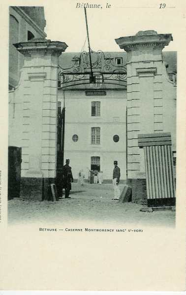
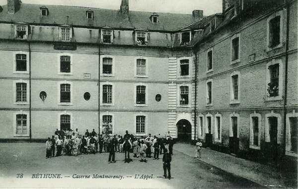
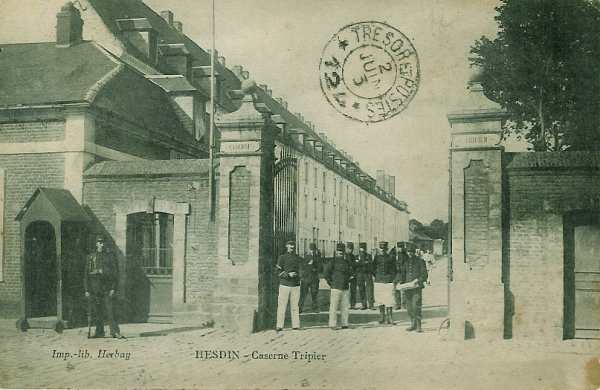

# Parcours du 73e R.I. (Béthune / Hesdin)

En 1914, le régiment fait partie de la 3e brigade (général Bernard), 2e division (général Duplessis) et 1e C.A. (général Franchet d’Esperey). Il est commandé par le colonel Bernard.

_Béthune : caserne Montmorency_
_Collection privée_

Il compte à la mobilisation 58 officiers, 3314 hommes. Les transports sont assurés par 192 chevaux et mulets.

_Béthune : caserne Montmorency_
_Collection privée_

_Hesdin : caserne Tripier_
_Collection privée_

### 5 août :

Le régiment est transporté en chemin de fer à Hirson. L’E.M. et le 3e bataillon vont cantonner à Bucilly, le 1e bataillon bivouaque à Watigny et le 3e à l’Abbaye.

### 6 août :

Le régiment se porte dans la zone de concentration de la brigade à Auvillers-les-Forges. Il détache la 12e compagnie à Mon-Idée et la 11e à Foulzy et Girondelle. Le 2e bataillon cantonne à Neuville-aux-Tourneurs avec le 1e groupe d’artillerie, et le 1e bataillon à Eteignières.

A 18h, le 2e bataillon reçoit l’ordre d’aller cantonner le lendemain à Maubert-Fontaine et d’envoyer une section au Tremblois.

### 7 -  9 août :

Le 2e bataillon arrive à Maubert-Fontaine à 07h50. Le reste du régiment occupe les mêmes cantonnements.

### 10 août :

A 9h50, le 1e bataillon arrive à Rocroi où il reçoit l’ordre d’aller cantonner à La Maison Rouge. Le 2e bataillon cantonne au Gué-d’Hossus et le 1e à Revin.

### 11 - 12 août :

Le 1e bataillon quitte Revin pour aller cantonner à Fumay. L’E.M. et le 3e bataillon sont à Rocroi (La Maison Rouge et Hiraumont), le 2e au Gué d’Hossus.

### 13 août :

Le 2e bataillon forme l’avant-garde et franchit la frontière belge à 03h. La colonne arrive à Couvin à 06h10. A 06h, suite à un ordre verbal du général de division,

- le 2e bataillon accompagne un groupe d’artillerie à Dourbes.

- Le 3e bataillon se rend à Vierves.

- Le 1e bataillon se rend de Fumay à Matagne-la-Petite.

### 14 août :

Le régiment se met en marche à 04h et entre à Rosée à 08h10. Le 2e bataillon se rend à Corenne où il cantonne. A 20h, le régiment reçoit l’ordre de se tenir prêt à partir. A 21h20, le 1e bataillon se met en marche pour se rendre à Onhaye ; à 9h30, le 3e bataillon est envoyé à Weillen.

### 15 août :

A 0h30, les 2e et 3e bataillons arrivent à Weillen, puis le 3e bataillon se rend à Sommière.

A 07h, l’artillerie allemande ouvre le feu sur Dinant et sur les 33e et 148e R.I.

A 09h, le colonel reçoit l’ordre d’organiser à Onhaye un centre de résistance.

- Le 1e bataillon organise la ferme de Frotmont.

- Le 2e bataillon est au sud et sud-ouest d’Onhaye (cote 252), avec deux compagnies en réserve sur la place du village.

Des tranchées et des barricades sont installées. Vers 11h, le 33e R.I. a subi des pertes et se replie. A 11h30, le 73e R.I. reçoit l’ordre de contre-attaquer les Allemands et de reprendre Dinant. Le 73e R.I. rentre dans Dinant en même temps que le 8e R.I.

A 19h, le 73e R.I. est remplacé par le 84e R.I. et se retire sur la grand’ route à 4 km en arrière de Dinant où il bivouaque.

Pendant ce temps, le 3e bataillon arrive à Sommière et la 12e compagnie part pour Houx où elle arrive à 11h après avoir subi le feu de l’artillerie allemande (4 tués et 1 blessé). A 12h, le 3e bataillon quitte Sommière et va renforcer la défense des ponts de Houx et d’Anhée.

### 16 août :

A 05h30, le régiment se dirige sur Dinant et s’établit sur la route de Neffe.

A 05h45, le 2e bataillon quitte le bivouac pour aller défendre le pont d’Anseremme et à 09h30, le 1e bataillon s’établit en cantonnement d’alerte à  la ferme de Wespin.

A 20h, le 3e bataillon reçoit l’ordre d’aller cantonner à Anhée pour garder le pont de Houx. Les 9e et 11e compagnies, ainsi que la section de mitrailleuses se trouvent à Anhée.

### 17 août :

A 05h20, le régiment reçoit l’ordre du général de brigade de défendre les ponts d’Anseremme, Dinant et Bouvignes. Le 1e bataillon assure la défense des ponts de Dinant dès 05h45.

A 09h15, la section de mitrailleuses du 2e bataillon exécute un feu sur un peloton de cavaliers allemands sur la rive droite de la Meuse.

A 10h30, le 3e bataillon quitte Anhée pour aller défendre le pont de Bouvignes. Comme l’artillerie allemande tire, il doit utiliser un itinéraire défilé, ce qui ralentit sa marche. Il arrive à 17h et prend les dispositions pour défendre le pont.

### 18 août :

La 5e compagnie quitte Anseremme pour aller exécuter des travaux de fortification au sud du cimetière de Dinant. A 10h, les compagnies de réserve du 1e bataillon reçoivent l’ordre de se tenir prêtes à remplacer celles du 84e qui sont appelées à Anhée.

### 19 août :

10h : la ferme du Rond-Chêne est canonnée par l’artillerie allemande. A 11h, une section du 3e bataillon, au pont de Bouvignes, tire sur l’artillerie allemande placée à la ferme de Viet.

### 20 août :

Les unités gardent la même position.

### 21 août :

A 16h, une demi-section du 3e bataillon, installée au château de Crèvecoeur, fait feu sur un groupe de cavaliers qui se montrent sur le plateau près de la ferme de Viet.

A 16h30, une patrouille allemande tire sur le village de Bouvignes, sans occasionner de dommage. Les Allemands tirent sans résultat sur des unités du 1e bataillon placées au pont de Dinant. Ils mettent le feu à une quinzaine de maisons du faubourg Saint-Jacques.

### 22 août :

A 02h30, le pont d’Anseremme, défendu par le 2e bataillon, est attaqué. A 07h, nouvelle attaque sur le pont d’Anseremme.

A 11h30, le régiment est informé qu’il va être relevé à Dinant, Anseremme et Bouvignes par la 51e division de réserve et, à 14h, les 1e et 3e bataillons quittent Dinant pour aller cantonner à Sommière. Le 2e bataillon en quitte Anseremme que vers 22h.

### 23 août :

A 05h10, le régiment alerté quitte Sommière pour se rendre à Bioul où il se place en dispositif de rassemblement face au nord. Il se rend à 11h sur les hauteurs de Saint-Gérard où il doit tenir les cotes 250, 254 et 270.

A 15h30, ordre de ralliement à Ermeton-sur-Biert. Le 1e bataillon va cantonner à  Anthée et les 2e et 3e bataillons à Morville.

### 24 août :

A 05h, le 73e R.I. reçoit l’ordre de défendre Morville, puis, à 09h30 de se replier sur Soulme. A 10h, il marche vers Gochenée et Gimnée où il cantonne.

### 25 août :

A 09h, le régiment a pris position  à l’intersection des chemins Vierves - Matagne-la-Grande et Niverlée - Dourbes, puis il se replie vers le Gué d’Hossus par Dourbes, Vierves, Petigny et Le Béguinage, sous le tir de l’artillerie allemande.

Les 2e et 3e bataillons gagnent le Gué d’Hossus à travers bois par Oignies et y arrivent vers 24h. Le 1e bataillon va cantonner à Petite-Chapelle.

### 26 août :

A 07h15, le 1e bataillon quitte Petite-Chapelle et se porte à la sortie sud-est de Rocroi. Le régiment marche sur Tarzy, Goncelin et La Neuville-aux-Tourneurs.

### 27 août :

A 05h30, le régiment quitte ses cantonnements pour se rendre à Beaumé par Belle-Epine et Aubenton. Il garde dès 8h35 les passages du Thon, puis va cantonner à Leuze et à Beaumé.

### 28 août :

Le 73e R.I. suit l’itinéraire Iviers, Saint-Clément, Dagny, Le Hocquet, Vigneux-Hocquet. A 10h45, il reçoit l’ordre d’aller cantonner à Agincourt.

### 29 août : bataille de Guise

A 13h, le régiment reçoit l’ordre de se porter vers La Neuville-Housset par l’est de Berlancourt. A 14h, il se dirige vers la ferme de La Chaussée. A 16h30, il doit se porter vers Sains-Richaumont pour appuyer l’attaque du 33e R.I. Le soir, il cantonne à Berlancourt et à Chevennes.

### 30 août :

A 05h, le régiment se porte à l’attaque de Puisieux en passant par Sains-Richaumont. Puisieux est trouvé inoccupé.

A 7h40, le 1e bataillon reçoit l’ordre du général de brigade de rester à sa disposition. Deux compagnies sont placées sur les pentes nord de Sains, face à Richaumont pour protéger le mouvement arrière du 33e R.I. Les tranchées allemandes sont situées sur le dos du terrain entre Colonfay et Puisieux.

A 9h45, le 73e R.I. reçoit l’ordre de se porter Faucouzy, en passant par Le Hérie-la-Viéville.

### 31 août :

Dès 04h, le régiment exécute une marche qui se termine à 10h à Grandlup. A 10h30, il reçoit l’ordre d’organiser avec deux bataillons la défense des passages de la Souche entre la ferme de Brazicourt et Barenton. A 13h, le régiment défend les passages de la Souche entre Froidmont et Cohartille. 23h : les 1e et 2e bataillons quittent leur positions pour rejoindre le régiment à Grandlup.

### 1 septembre :

Le régiment quitte Grandlup pour exécuter une marche forcée qui se termine à Ventelay. Il va cantonner à Ventelay, Bouvancourt et Bourgogne.

### 2 septembre :

Le régiment marche par Ventelay, Montigny-sur-Vesle,  Brancourt, Treslon et Sarcy où il cantonne.

### 3 septembre :

Le 73e R.I. quitte Sarcy pour exécuter une marche passant par Chambrezy, Champlat, La Neuville, Cuchery, Fleury-la-Rivière, Damery, Vauciennes, Ablois-Saint-Martin. La Marne est traversée à Damery et le cantonnement a lieu à Boursault.

### 4 septembre :

A 06h40, le régiment reçoit l’ordre du général de brigade de porter une compagnie vers le pont de Meulan où des uhlans et un détachement d’infanterie sont signalés. La 4e compagnie s’y rend mais, arrivée au pont, elle reçoit une vive fusillade et perd 83 hommes.

En arrivant à Ablois-Saint-Martin à 08h45, le 2e bataillon reçoit l’ordre de détacher deux compagnies et une section de mitrailleuses à la ferme des Patis pour couvrir le défilé de l’arrière-garde. Le régiment se rend ensuite à Montmort et cantonne à La Caure. Le colonel Bernard est désigné pour le commandement de la 3e brigade d’infanterie. Il est remplacé par le chef de bataillon Dachat.

### 5 septembre :

Le 73e R.I. quitte Lacaure à 0h15 et marche sur Baye, Sézanne, Vindey, Le Plessis, La Celle-sous-Chantemerle, où il cantonne. Le chef de bataillon Truffert du 1e R.I. est nommé lieutenant-colonel et prend le commandement du régiment.

### 6 septembre : début de l’offensive

Le régiment quitte La Celle-sous-Chantemerle et se rend à La Forestière. Il est rassemblé au sud d’Esternay en réserve et se porte vers la localité par les bois. A 14h, il reçoit l’ordre d’attaquer par l’est. Engagé dans les bois, il est en butte aux feux de l’artillerie de la 1e division française. Avis est immédiatement envoyé de faire allonger le tir.

Le 2e bataillon se déploie à la lisière est et, voyant une crête tenue à 300 m, se lance à l’assaut. Il perd en quelques minutes tous ses officiers et une partie de ses hommes et doit redescendre à la lisière. A 23h parvient l’ordre d’aller cantonner près de Bricot-la-Ville.
La journée a coûté au régiment 73 tués, 191 blessés et 211 disparus.

### 7 septembre :

A 06h20, le régiment est rassemblé au sud d’Esternay :

- 1e bataillon vers Châtillon
  3e bataillon à l’est de la cote 202
  2e bataillon 200 m en arrière

Esternay est évacué par les allemands. Le régiment entame une poursuite vers Montmirail.

### 8 septembre :

Le 73e R.I. marche sur Vauchamps et appuie la 4e brigade lancée à l’assaut de ce village. Les 1e et 3e bataillons marchent à travers bois pour se porter sur la crête de la rive sud du Petit Morin, où ils bivouaquent.

### 9 septembre :

Les rives nord du Petit Morin sont évacuées et la rivière franchie. La brigade reçoit l’ordre d’appuyer vers Fromentières la 19e division qui attaque vers Bannay - Baize pour faciliter le débouché de la IXe armée. Arrivée à Fontaine-au-Bron vers 16h50. Une section est envoyée en reconnaissance à la ferme de la Roquetterie.

A 19h, le régiment est à l’avant-garde de la brigade et est dirige vers Fromentières. Les 33e et 73e R.I. rentrent dans le village. Ce dernier cantonne ensuite à La Chapelle-sous-Orbais.

### 10 septembre :

Le premier objectif est Mareuil, occupé par les allemands. A 16h, le régiment cantonne à Comblizy et Nesle-le-Repons.

### 11 septembre :

La Marne est franchie au pont de Verneuil et la marche reprise vers Châtillon-sur-Marne par Vandières. L’avant-garde signale une colonne allemande qui se replie sur le plateau au-delà de Cuchery dans la direction nord-est. L’artillerie se met en batterie mais les chemins et champs détrempés et le brouillard empêchent cette opération de s’exécuter. Le régiment cantonne à Cuchery.

### 12 septembre :

Le régiment parvient aux hauteurs à 500 m de Ville-Dommange. L’artillerie tire sur les colonnes allemandes qui rentrent dans Reims, puis les allemands sont signalés vers Les Mesneux et Bezannes. Le 1e bataillon est mis en mouvement vers l’objectif Maison-Blanche qui est atteint sans pertes.

A 18h, l’ordre est donné de marcher sur Reims par la route Bezannes - Reims. Le régiment rentre dans la ville par le faubourg de la Vesle en même temps que le 33e R.I. et y cantonne.

### 13 septembre :

A 10h50, ordre est donné au régiment entier de se porter à la gare pour appuyer le 33e R.I. qui marche sur Betheny. A 12h50, le régiment est arrêté sur le boulevard extérieur qui donne sur la place de Betheny. Le 3e bataillon est envoyé au faubourg Cérès.

### 14 septembre :

Les éléments de première ligne sont soumis à un feu intense de l’artillerie allemande.

### 15 septembre :

Une ligne de défense est établie. Le 2e bataillon tient les trois ronds-points de la place Betheny, Witry, Comay.

### 16 septembre :

Le régiment attaque vers Betheny.

### 17 septembre :

Les Allemands lancent une attaque contre le 3e bataillon, qui est repoussée avec de grosses pertes.

### 18 septembre :

Le régiment est relevé par la 52e division de réserve. Il cantonne ensuite au Thillois.

Par la suite, il changera plusieurs fois de secteur, mais dans le cadre de la guerre de tranchées.