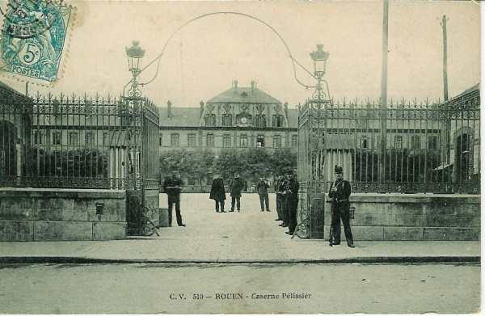
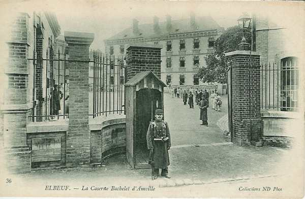
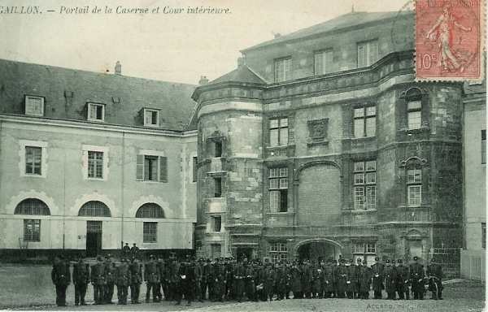

# Parcours du 74e R.I. (Rouen, Elbeuf)

En 1914, le régiment fait partie de la 9e brigade (général Tassin), 5e division (général Verrier) et 3e C.A. (général Sauret). Il est commandé par le colonel Bouteloup.

_Rouen : caserne Pélissier_
_Collection privée_

_Elbeuf : caserne Bachelet d’Amville_
_Collection privée_

### 5 août :

Le régiment s’embarque à la gare de Rouen pour rejoindre sa base de concentration et débarque à Amagne - Lugny le 6 août.

_Gaillon : caserne de deux compagnies du 74e R.I._
_Collection privée_

### 6 août :

Le cantonnement intermédiaire du 74e est à Saulx - Mauclin. Dans l’après-midi, le régiment est dirigé vers Poix-Terron, Villers-le-Tourneur et Montigny-sur-Vence.

### 7 août :

A 13h, arrivent les éclaireurs, des cavaliers du 8e chasseurs à cheval.

### 8 - 9 août :

Le 74e R.I. reste dans ses cantonnements.

### 10 août :

Conformément à l’ordre général n° 7, le régiment doit modifier ses cantonnements : Guignicourt, Hocmont, Touligny, Poix-Terron et Montigny-sur-Vence. Le Q.G. de la 5e division est à Yvernaumont et celui de la 9e brigade à Guignicourt.

### 11 - 12 août :

Même cantonnements.

### 13 août :

Le 74e R.I. quitte ses cantonnements pour se rendre à Mondigny, Fagnon et Warnécourt.

### 14 août :

Le régiment garde ses cantonnements.

### 15 août :

Le 74e R.I. se rend à Belval, Haudrecy et Tourmes.

### 16 août :

Le régiment fait mouvement vers le nord-ouest via Hardoncelle, Remilly-les-Pothées, Servion, Rouvroy-sur-Audry, l’Echelle, Blombay, Etalle, Maubert-Fontaine, Regniowez. Le cantonnement a lieu à Regniowez, Cul-des-Sarts (Belgique). Les avant-postes surveillent les directions de Chimay, Couvin, Fumay.

### 17 août :

Le 74e R.I. se porte par Chimay sur Rance.

### 18 août :

Le régiment se porte sur Barbançon.

### 19 août :

Le 74e R.I. fait route vers Boussu-lès-Walcourt et va cantonner à Tarcienne, Limsonry et Praile. Une vigie est installée dans le clocher de Tarcienne.

### 20 août :

Le régiment se rend à Acoz, Villers-Poterie, Figotterie et Joncret. Un avion allemand survole la colonne entre Tarcienne et Gerpinne. Le régiment est en tête du gros de la division.

A 15h, le régiment doit rejoindre Aiseau avec pour mission de tenir les ponts de la Sambre depuis Oignies inclus jusqu’à Pont-de-Loup exclu.

### 21 août :

Le 2e bataillon est aux avant-postes. La compagnie de Presles s’est portée entre Aiseau et Roselies. Vers 10h, on entend quelques coups de canon dans la direction de Tamines.

Les 7e et 8e compagnies sont refoulées par des attaques allemandes avec des pertes sérieuses et se replient par Aiseau jusqu’au château de Presles. Roselies est évacué. Dans la soirée, ordre est donné à la 9e D.I. de reprendre Roselies.

### 22 août :

Les 1e et 3e bataillons sont chargés de l’attaque de nuit à Roselies. Ils partent d’Aiseau à 0h30 Le 1e bataillon attaquera par l’est, le 3e par l’ouest. Les troupes françaises peuvent pénétrer dans le village dont les issues ne sont pas gardées.

Vers 03h, une vive fusillade se fait entendre. Elle part des maisons à l’intérieur du village, qui ont été organisées défensivement avec des mitrailleuses. Un combat de rues s’engage et le 74e R.I. éprouve de fortes pertes. Pour dégager le régiment, des contre-attaques sont exécutées par deux bataillons du 129e R.I. et un bataillon du 36e R.I. Elles ne réussissent pas et toutes les unités doivent se replier le long du village d’Aiseau jusqu’au-delà de Presles où d’autres troupes organisent une position de repli.

Le colonel donne l’ordre de reformer le régiment à La Figotterie et de la diriger vers Silenrieux où il cantonne. Le 74e R.I. a perdu presque le tiers de son effectif.

### 23 août :

Le régiment, reformé à Silenrieux, reçoit l’ordre d’organiser à l’est de Walcourt, le front 238 - 296.

### 24 août :

Aucune attaque allemande ne se produit et le 74e R.I. se replie sur Castillon via Boussu-lès-Walcourt.

### 25 août :

Le régiment se dirige sur Baives où il stationne une partie de la journée. Il doit organiser une position dans cette localité. A 19h, il part pour Les Trieux où il bivouaque.

### 26 août :

Départ à 06h pour La Flamengrie.

### 27 août :

Repli à 03h50 sur la position d’Etréaupont. A 19h, départ de La Chaussée pour Vervins.

### 28 août :

Etape de Vervins à Sains-Richaumont.

### 29 août : bataille de Guise

Départ à 04h pour attaquer Bertaignemont. Le régiment aborde la localité mais ne peut en déboucher. Il se replie et se reforme à Landifay dans le but de lancer une attaque de nuit sur Bertaignemont.

### 30 août :

Le 74e R.I. attaque Bertaignemont et se maintient en avant de Landifay. Par la suite, le 10e C.A. évacue Bertaignemont et la 9e division se replie vers la ferme de Saint-Rémy (Landifay). Le régiment cantonne à Montigny-sur-Serre.

### 31 août :

Départ à 02h30. Repli sur la cote 102 - 120 au sud de Chalandry pour couvrir le recul du C.A. A 20h, ordre est donné de se replier sur Laon.

### 1 septembre :

Après un arrêt à Laon, le régiment marche par Bruyères, Monthenault, Chamouille, Cerny-en-Laonnois, Vendresse, Oeuilly, Revillon.

### 2 septembre :

Le régiment se rend à Caulaincourt. Il est en arrière-garde, en contact avec les Allemands.

### 3 septembre :

Départ à 0h30 pour passer la Marne.

### 4 septembre :

Le 74e R.I. arrive à Bièvre à 0h30.

### 5 septembre :

Le repli continue vers le Grand Morin. Cantonnement à Bouchy-le-Repos et à La Soucière.

### 6 septembre : début de l’offensive

Rassemblement à 04h à  l’ouest de Bouchy-le-Repos et arrivée à Escardes vers 15h. L’entrée en contact avec l’armée allemande a lieu à Courgivaux où se déroule un combat assez violent jusqu’à la tombée de la nuit. Le colonel est blessé d’une balle.

### 7 septembre :

Le combat reprend à 04h. Le colonel Viennot prend le commandement du régiment. Les allemands évacuent Courgivaux. Le régiment marche ensuite vers Neuvy et Joiselle.

### 8 septembre :

Le 74e R.I. quitte Joiselle à 06h en tête du gros de la 5e D.I. Il se rend à Hochecourt pour couvrir une position d’artillerie puis se forme à la cote 212, derrière le 39e R.I. avec mission de franchir le Petit Morin, mais le mouvement est arrêté par les Allemands. Le régiment cantonne sur place.

### 9 septembre :

Le régiment a comme objectif Montmirail et se trouve en tête de la 9e brigade. Montmirail est contourné par l’est et vient d’être évacué. Ensuite, le 74e R.I. suit l’itinéraire l’Echelle-le-Franc, Corrobert, Verdon où il bivouaque.

### 10 septembre :

Le régiment quitte son bivouac vers 05h. Il se porte sur Verdon, Condé-en-Brie, Joncret, Reuilly, Passy-sur-Marne. Le pont de Sauvigny est franchi. Le cantonnement a lieu à Passy-sur-Marne, Rosay et Courcelles. 400 hommes venus du dépôt viennent combler les pertes du régiment.

### 11 septembre :

Le 74e R.I. marche par Passy, Trélou, Vincelles, Verneuil, Passy-Grigny, Aougny, Lagery. Stationnement à Lehéry et Lagery.

### 12 septembre :

Le régiment prend rang en tête du gros de la colonne et arrive à Gueux. Il est engagé aux côtés du 39e R.I. avec comme objectif la lisière sud de Thillois. A 16h30, il pénètre dans la localité. Les 1e et 2e bataillons sont arrêtés dans leur offensive par des troupes occupant des tranchées à la lisière du bois de Thillois, lieu de stationnement.

### 13  - 16 septembre :

L’information manque.

### 17 septembre :

Départ d’Hermonville à 04h. Le 1e bataillon et deux compagnies du 2e bataillon entrent dans la composition de la 11e brigade et restent à Loivre. C’est le début de la guerre de tranchées.