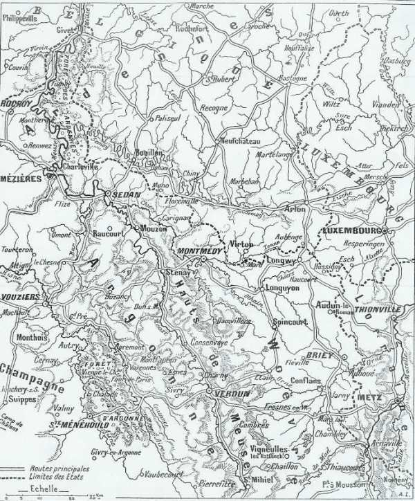

# Carte de l’évolution des IIIe et IVe armées françaises

Le secteur de la concentration, des offensives puis de la retraite des IIIe et IVe armées françaises.

_Carte de l’évolution des IIIe et IVe armées_