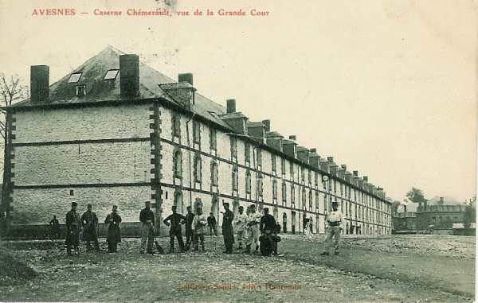
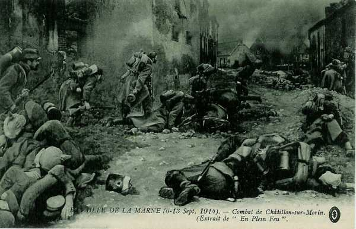

# Parcours du 84e R.I. (Avesnes-sur-Helpe, Le Quesnoy, Landrecies)

En 1914, le régiment fait partie de la 2e brigade (général Sauret), 1e division (général Gallet) et 1e C.A. (général Franchet d’Esperey). Il est commandé par le colonel Benoit.

_Avesnes : caserne Chémerault_
_Collection privée_

Son effectif se monte à 59 officiers, 3304 sous-officiers, caporaux et soldats.

Le train régimentaire est particulièrement bien décrit :
189 chevaux, 2 fourgons à bagages, 13 fourgons à vivres, 12 voitures à vivres et à bagages, 3 voitures à viande, 11 voitures de cantine, 3 voitures médicales, une forge, 12 voitures à munitions, 2 voitures d’outils et 3 caissons pour les sections de mitrailleuses.

### 5 août :

Départ du Quesnoy et débarquement à Aubenton. Cantonnement à Estrebay, Flaignes, Les Oliviers, La Cerleau.

### 6 août :

Cantonnement à Sormonne.

### 7 août :

Le 84e R.I. quitte Sormonne et va cantonner à Mouzon.

- Le 3e bataillon et une section de mitrailleuses tiendront les ponts de la Meuse, de Mézières à Mouzon.

- Le 2e bataillon tiendra les ponts de Mouzon à Château-Regnault.

Le gros du régiment se trouve à Houldizy et Damouzy.

### 8 août :

Le colonel du régiment reçoit à Damouzy un ordre prescrivant la couverture plus au nord.

- Le 1e bataillon se rend à Château-Regnault, Monthermé, Deville.
  Un demi-bataillon fait mouvement d’Houldizy à Renwez.

Les bataillons sont ensuite relevés par le 291e R.I. (régiment de réserve) et regagnent Renwez.

### 9 août :

Même situation.

### 10 août :

D’après l’ordre n° 4, le 1e C.A. doit se porter sur la Meuse en deux colonnes. Le 84e R.I. doit s’établir en avant-garde de la 1e division à Monthermé.

### 11 - 12 août :

Même situation.

### 13 août :

Le 1e C.A. se porte vers le nord de façon à se trouver le 14 à l’est de Philippeville, prêt à s’opposer aux tentatives allemandes éventuelles de franchir la Meuse entre Givet et Namur.

Le 84e R.I. quitte Monthermé à 01h35 et marche vers Hargnies, lieu de cantonnement.

### 14 août :

Départ à 01h30 et marche vers Vireux-Molhain, Mazée, Gimnée, Vodelée, Surice avec cantonnement à Omezée, Surice et Soulme.

### 15 août :

Le régiment marche dans la colonne de la 12e division via Omezée, Morville, Anthée. Il reçoit l’ordre d’organiser une position de repli à la lisière ouest du village d’Onhaye, puis l’ordre de reprendre Dinant, appuyé par l’artillerie du C.A.

A 19h, les 8e et 73e R.I. ont enlevé Dinant. Le 84e R.I. envoie un bataillon à Dinant, un autre au pont d’Anseremme, le 3e restant à la lisière d’Onhaye.

### 16 août :

Le 2e bataillon occupe la rive gauche de la Meuse à Dinant. A 11h, le 1e bataillon rentre d’Anseremme et se met en réserve à l’ouest d’Onhaye.

Suite à l’ordre général n° 16, la 1e division a pour mission de tenir la Meuse entre Anseremme exclu et Ermeton inclus.

### 17 août :

Installation en cantonnement d’alerte à Onhaye.

### 18 août :

Le 2e bataillon est rappelé de Dinant et il rejoint Onhaye.

### 19 - 21 août :

Le 84e R.I. reste cantonné à Onhaye et à Gérin.

### 22 août :

Le régiment se porte vers Sart-Saint-Laurent. A 11h50, il reçoit l’ordre de mettre Furnaux et Romedenne en état de défense.

### 23 août :

Le 84e R.I. subit le tir de l’artillerie lourde allemande. A 10h40, il reçoit l’ordre de se replier sur Saint-Gérard et, à 20h, il cantonne à Biert-l’Abbé.

### 24 août :

Le régiment se porte sur Rosée puis sur Romerée. A 18h, le 1e bataillon est envoyé à Sart-en-Fagne pour couvrir la direction de Merlemont - Philippeville. A 20h, le cantonnement de Romedenne est attaqué, ce qui oblige à poursuivre la retraite.

### 25 août :

Le régiment se dirige vers Nismes par Matagne-la-Petite et Dourbes. A 13h, il prend position à Couvin.

### 26 août :

Le 84e R.I. se replie vers Cul-des-Sarts puis vers Signy-le-Petit où il cantonne.

### 27 août :

Le régiment se porte sur Besmont où il cantonne.

### 28 août :

Le 84e R.I. va cantonner à Hary.

### 29 août : bataille de Guise

Suite à l’ordre du général Lanrezac, la Ve armée doit se porter vers le nord-ouest au-delà de l’Oise, ce qui implique pour le 84e R.I. un combat dans la région de Le Hérie-la-Viéville.

A 03h, le régiment quitte ses cantonnements de Hary et, à 11h, une action est engagée sur le front de la division à Le Hérie-la-Viéville et Landifay contre les troupes allemandes qui ont franchi l’Oise à Guise.

A 13h, la 1e D.I. se porte à l’attaque dans la direction générale de la route de Guise. La 1e brigade attaque vers les fermes de Louvroy et de la Désolation. Le 1e bataillon et la moitié du 3e se portent à l’attaque vers la ferme de la Bretagne, le 2e se portant vers le bois de Bertaignemont. A 18h, ce bois est enlevé. L’effort se porte ensuite sur la ferme de Louvroy mais les Allemands conservent la position.

### 30 août :

A 02h, les unités du 84e R.I. sont ralliées et participent à une attaque vers la ferme de Louvroy. A 04h, les allemands bombardent les tranchées établies par les avant-postes français établis vers la ferme de Bretagne.

A 10h45, le 84e R.I. doit se replier  sur la cote 128 vers Faucouzy, puis il va cantonner à Margny.

### 31 août :

Le 1e C.A. continue son repli sur l’Aisne.

### 1 septembre :

Cantonnement à Muscourt.

### 2 septembre :

La 1e D.I. marche via Romain, Breuil-sur-Vesle, Vandeuil. Cantonnement à Serzy-et-Prin et à Savigny-sur-Ardres. A 15h, les Allemands sont signalés. Le 84e est formé en rassemblement articulé aux abords de la cote 233 (croupes dominant Vandeuil).

### 3 septembre :

Le régiment marche par Chéry, Romigny, Jonquery, Binson, Arquigny, Breuil-sur-Marne, Oeuilly. Le 3e bataillon, en arrière-garde, se fait accrocher et une cinquantaine d’hommes sont tués ou blessés. Le régiment passe la Marne sur un pont de bateaux entre Reuil et Oeuilly. Le cantonnement a lieu dans les fermes des Echenots, Beaurepaire et La Bondonnerie.

### 4 septembre :

Réveil à 01h et départ à 02h30 en suivant l’itinéraire Le Chêne-la-Reine, forêt d’Enghien, Mareuil-en-Brie, Le Mesnil-les-Déserts, Beaunay. Cantonnement à Le Bouc-aux-Pierres et à Bannay.

### 5 septembre :

L’ordre parvient de reprendre l’offensive vers le nord-ouest. Le 84e R.I. doit cantonner aux Essarts-le-Vicomte.

### 6 septembre : début de l’offensive

Le 84e R.I. doit être rassemblé à La Pimbaudière pour attaquer vers Montmirail. L’axe d’attaque du 1e C.A. est Les Essarts, Esternay, Champguyon, Montmirail. Le colonel Benoît est remplacé par le colonel Charpy, du 43e R.I.

A 08h, l’objectif est précisé : axe de la grand’ route Seu - Châtillon avec Châtillon comme objectif, en liaison avec le 127e R.I. Le 2e bataillon parvient dans Châtillon qu’il prend d’assaut maison par maison, avec à sa tête le général Sauret, commandant de la 2e brigade. Les mitrailleuses allemandes sont solidement installées dans le cimetière de la localité.

_Combat de Châtillon-sur-Morin_
_Collection privée_

A 11h, la 1e D.I. annonce que les Allemands ont abandonné la ligne cote 200 - Retourneloup - Château d’Esternay. Le 84e R.I. essaie de se porter vers cette ligne mais est arrêté par les feux des mitrailleuses allemandes.

### 7 septembre :

Le 3e bataillon occupe Châtillon-sur-Morin. Le nouvel objectif est le Pont-Neuf et le château d’Esternay. Le château est atteint à 9h45 par le 8e R.I. Le 1e bataillon passe le Grand Morin au pont de chemin de fer, direction station d’Esternay. A 16h, départ pour Vivier, les Essarts, puis pour Fontaine-Armée.

### 8 septembre :

L’offensive se poursuit dans la direction général de Vauchamp. Le 3e bataillon arrive vers Cornantier, les deux autres sont rassemblés entre Fontaine-Armée et Maclaunay où a lieu une violente canonnade allemande. Un ballon captif (Drachen) observe les mouvements des troupes françaises. Le 2e bataillon s’installe dans des tranchées au nord de Maclaunay. Le 3e bataillon tient les ponts de Courbetaux.

### 9 septembre :

Les Allemands sont en pleine retraite. A 11h40, parvient l’ordre d’attaque sur Margny, le 2e bataillon par La Noue, Champ-Martin, le 1e bataillon par La Villeneuve. Vers 15h, en vue de Margny, on aperçoit des masses allemandes se retirant de Margny vers le bois de Thomasset mais l’artillerie française arrive trop tard et l’objectif a disparu. Le 84e R.I. atteint Margny évacué et y stationne.

### 10 septembre :

A 06h, reprise de la marche vers le nord-est pour franchir le Surmelin par Verdon, Le Breuil. Le mouvement continue vers la Marne par La Chapelle-Montaudon, Chavenay et Dormans. Ordre de continuer par Dormans, Chassaing et Vincelles. La traversée au pont de Dormans s’effectue compagnie par compagnie. Le régiment se porte ensuite vers La Chapelle - Hurlay pour assurer le débouché du 1e C.A. au-delà de la Marne.

### 11 septembre :

La 2e brigade doit gagner Anthenay par Vincelles, Verneuil et Passy-Grigny. Les Allemands se sont repliés vers Reims et le 1e C.A. est orienté vers cette direction, face au nord-est. Il arrive à Violaine.

### 12 septembre :

Le 1e C.A. marche sur Reims, et le 84e R.I. par Romigny, Chambrecy, Bligny, Antilly, Saint-Euphraise pour aller se rassembler au nord-est de Clairizet. Les routes sont fortement encombrées et le régiment n’atteint son cantonnement que vers 23h.

### 13 septembre :

La poursuite continue vers le nord-est. Vers 10h45, le 84e R.I. est à 1 km à l’ouest de la ferme de Constantine. Il s’apprête à déboucher par les faubourgs nord et nord-ouest de Reims (Neuvillette, Saint-Pierquin) et cantonne à Courcelles.

### 14 septembre :

Le 84e R.I. se tient prêt à soutenir l’attaque vers Brimont, Bourgogne, Fresnes.

### 15 septembre :

Le 3e C.A. doit reprendre l’attaque vers Brimont. Il s’avère toutefois impossible d’atteindre la ferme Madelin à cause d’un feu intense d’artillerie. Les Allemands contre-attaquent et progressent grâce à leur supériorité numérique.

### 16 septembre :

Début de la guerre de tranchées.