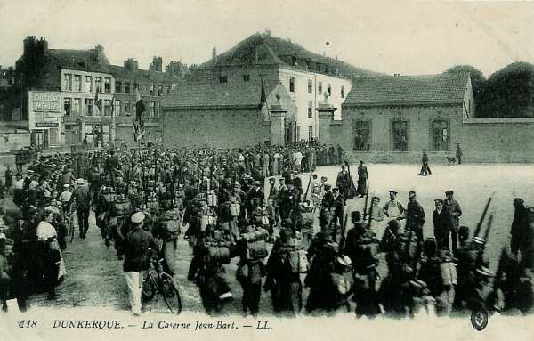
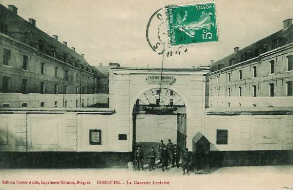

# Parcours du 110e R.I. (Dunkerque, Gravelines, Bergues)

En 1914, le régiment fait partie de la 4e brigade (général Doyen), 2e division (général Duplessis) et 1e C.A. (général Franchet d’Esperey). Il est commandé par le colonel Lévy.

_Dunkerque : caserne Jean Bart_
_Collection privée_

_Bergues : caserne Leclaire_
_Collection privée_

Son effectif se monte à 58 officiers, 3366 sous-officiers, caporaux et soldats.

Le train régimentaire est particulièrement bien décrit :
45 chevaux de selle, 117 chevaux de trait, 24 voitures à bagages et munitions, 3 voitures médicales, 3 caissons pour les mitrailleuses, 13 fourgons à vivres et à bagages, 2 voitures à vivres et à bagages, 3 voitures de viande, une voiture de forge et 2 voitures à outils.

### 7 août :

Le régiment est dirigé vers la gare régulatrice d’Hirson. Le cantonnement s’effectue à Any.

### 8 - 9 août :

Le cantonnement a lieu à Tarzy et à Auge.

### 10 août :

La 2e division se porte sur la Meuse par Mon-Idée, Maubert-Fontaine, Les Mazures. Cantonnement le soir à Bourg-Fidèle et Sévigny-la-Forêt.

### 11 août :

La 110e R.I. se porte sur Revin par Neuve-Forge. Arrivé à Revin, le 1e bataillon relève celui du 73e et garde les ponts de Revin, Anchamps et Laifour. Le régiment cantonne à Revin.

### 12 août :

Mêmes dispositions.

### 13 août :

Le régiment se porte par Fumay, Oignies, Olloy sur Mariembourg et Fagnolle.

### 14 août :

Le 110e R.I. continue son mouvement vers le nord par Villers-en-Fagne, Merlemont, Villers-le-Gambon, Vodecée. Cantonnement à Saint-Aubain.

A 21h, le régiment se met en route pour Florennes et Bioul. A son arrivée à Bioul, le régiment relève le 148e R.I. Les cantonnements d’alerte sont au nord de Bioul, entre la route Bioul - Annevoie et le chemin de fer Bioul - Warnant, avec une compagnie détachée à Warnant, en liaison avec le 148e qui occupe Yvoir et Anhée.

A 15h, le régiment reçoit l’ordre de se porter par Warnant sur Haut-le-Wastia avec mission de renforcer le détachement du 148e d’Anhée et d’occuper la ferme de Hontoir.

**[Positions françaises à Haut-le-Wastia](../img/haut_le_wastia.jpg)**

En arrivant à Haut-le-Wastia, le commandant du 3e bataillon apprend qu’Anhée et Houx ont été renforcés par un bataillon du 73e et que Sommière est occupé par une compagnie du 8e R.I. Le bataillon cantonne à la ferme de Hontoir et à Haut-le-Wastia. Le reste du régiment cantonne à Bioul.

### 15 août :

Pas d’information.

### 16 août :

Le commandant Manqui du 3e bataillon dispose

- Une compagnie au pont de Houx
  Une demi-section à l’écluse de Houx

Le reste du bataillon cantonne à l’usine et à l’école d’Anhée. Le bataillon est en liaison à Bouvignes avec le 84e R.I. et à Yvoir avec le 248e R.I.

**[Positions françaises dans la cuvette d’Anhée](../img/Cuvette_anhee.jpg)**
Cliquez sur le document ouvert pour l’agrandir.

### 17 août :

Le colonel Lévy reçoit l’ordre de se transporter au château de Senenne et de centraliser la défense des passages de Houx et d’Yvoir. Depuis le matin, le poste d’Yvoir est commandé par le colonel commandant le 45e R.I. Le génie prépare la destruction aux ponts d’Yvoir et de Houx. Les deux compagnies en réserve à Haut-le-Wastia sont appelées au château de Senenne.

Vers 14h, un peloton de chasseurs à cheval français reçoit des coups de feu à hauteur de Houx, partant d’un point situé entre la petite chapelle et la cote 200. La compagnie chargée de la garde de l’écluse de Houx prend rapidement ses emplacements de combat et ouvre le feu. Les allemands subissent des pertes assez  sensibles. A ce moment, une batterie allemande située vers la cote 200 ouvre le feu vers l’écluse. La maison de l’éclusier prend feu.

Le soir, le cantonnement d’alerte se situe à Haut-le-Wastia, au château de Senenne, à Grange et à Anhée.

**[Positions françaises dans la cuvette d’Anhée](../img/cuvette_anhee2-2.jpg)**
Cliquez sur le document ouvert pour l’agrandir.

### 18 août :

Trois reconnaissances vers Evrehailles rapportent que le village n’est pas occupé.

### 19 août :

A 20h45, une reconnaissance de nuit rapporte qu’Evrehailles et Purnode ne sont pas occupés, mais entre Purnode et Dorinne, la reconnaissance se heurte à des avant-postes. Elle signale un projecteur et des postes de signalisation dont un à Poilvache.

### 20 août :

Une reconnaissance signale qu’Evrehailles et Purnode ne sont pas occupés.

### 21 août :

A 22h15, les Allemands font mine d’attaquer le pont de Houx et le barrage au sud, en même temps que le pont de Bouvignes.

### 22 août :

Le régiment reçoit l’ordre de rejeter les détachements allemands qui sont passés par les ponts de Dinant et d’Hastière, conjointement avec la 71e division de réserve qui tient encore Sommière et Onhaye. La division se forme en deux colonnes sur la grand’ route d’Ermeton -  cote 300 - Morville.

A 20h45, le régiment arrive à Gérin et y trouve des fractions de la 51e division de réserve. Le régiment bivouaque au sud du carrefour Onhaye, anthée, Gérin, Hastière.

### 23 août :

Les compagnies quittent leurs emplacements de combat de Houx, le château de Senenne et Haut-le-Wastia à 01h pour se diriger vers le moulin de Warnant, ferme Bruant, Ronchat, ferme de Romée.

A 01h35, la 2e division a ordre de prolonger à gauche la 1e division de façon à occuper la cote Saint-Gérard - ferme Saint-Laurent. L’artillerie divisionnaire se met en batterie vers Graux.

A 14h45, le régiment reçoit l’ordre de se porter vers Ermeton-sur-Biert et, à 15h45, le régiment reçoit l’ordre de se porter sur Hastière par La Motte, Fter, Serville et Gérin. Sa mission est de rejeter sur la Meuse les détachements qui sont passés sur la rive gauche de la Meuse et ont refoulé la 51e division de réserve presque jusqu’à la ligne Sommière - Onhaye.

La 3e brigade suit l’itinéraire Ermeton-sur-Biert - Anthée avec la même mission. Le 8e R.I. est maintenu en réserve avec le colonel Pétain, commandant de brigade.

A 21h, les Allemands évacuent la région sud de Gérin.

### 24 août :

Le colonel reçoit l’ordre de rallier la 2e division à Morville.

- Le 1e bataillon à Miavoye
  Le 2e bataillon au château de Fontaine
  Le 3e bataillon en réserve.

Vers 11h, les trois bataillons forment successivement un repli sur le mamelon situé entre Omezée et Soulme puis arrivent à Doische.

### 25 août :

Le régiment quitte son cantonnement à 04h. En arrivant vers Vierves, il reçoit l’ordre de se porter sur Gué d’Hossus par l’itinéraire Vierves, Le Mesnil, Oignies.

### 26 août :

Le 110e R.I. quitte le gué d’Hossus à 09h et marche par Rocroi, Eteignières, Mon-Idée pour aller cantonner à Fligny.

### 27 août :

Les 1e et 2e bataillons se portent sur Iviers et Dohis où a lieu le cantonnement. Le 3e bataillon est à la disposition de la division de cavalerie.

### 28 août :

Les 1e et 2e bataillons quittent leurs cantonnements entre 04h et 05h, le 3e restant à la disposition de la D.C. L’itinéraire suivi est Saint-Clément, Dagny, Le Hocquet, Vigneux-Hocquet, Tavaux où les bataillons cantonnent.

### 29 août : bataille de Guise

Le 110e R.I. est désigné comme réserve de C.A. et va se porter à l’ouest de la route de Marle à Le Hérie-la-Viéville puis il fait face à Sains-Richaumont. A 17h, le régiment reçoit l’ordre de se porter à l’attaque derrière la 1e division qui a débouché de Le Hérie-la-Viéville. Le bivouac a lieu près de la ferme de Bertaignemont.

### 30 août :

A 03h15, la 2e compagnie prend part à une attaque de nuit dirigée par le 1e R.I. Le tir allemand fait perdre au régiment 350 tués, blessés ou disparus. A 09h30, le régiment reçoit l’ordre de se diriger vers Faucouzy puis d’aller cantonner à Montceau-le-Neuf.

### 31 août :

Le régiment marche par Bois-lès-Pargny, Grandlup puis cantonne à Missy.

### 1 septembre :

Le régiment quitte Missy à 0h et marche par Missy, Gizy, Festieux, Corbeny, Pontavert et traverse l’Aisne et le canal latéral de l’Aisne à la Marne. Cantonnement à Bouffignereux et Guyencourt.

### 2 septembre :

Le régiment suit l’itinéraire Ventelay, Montigny-sur-Vesle, Jonchery-sur-Vesle, Branscourt et Treslon. Pour couvrir le mouvement de la division, le régiment tient le plateau dominant au sud de la route Reims - Fismes.

### 3 septembre :

La 110e R.I. quitte son cantonnement de Treslon et suit l’itinéraire Tramery, Sarcy, Chambrecy, Champlat, La Neuville, Cuchery, Fleury-la-Rivière, Damery, Vauciennes, Ablois-Saint-Martin où il cantonne.

### 4 septembre :

Le régiment marche vers Champaubert et cantonne à Baye.

### 5 septembre :

Le 110e R.I. marche par Sézanne, Vindey, Le Plessis, Fontaine-Denis et cantonne à Chantemerle et Béthon.

### 6 septembre : début de l’offensive

Le 1e bataillon gagne Bricot-la-Ville et les 2e et 3e bataillons sont rassemblés au nord-ouest de La Forestière, face au nord.

A 07h45, la 1e division attaque la cote 200 Retourneloup - Esternay. La 2e division reçoit l’ordre d’appuyer cette attaque en se portant vers La Noue et le 1e bataillon du 110e R.I. de se porter sur La Noue.
A 10h45, le régiment doit tenir le château de La Noue.

A 11h20, la 4e  brigade doit se porter sur la corne sud de la forêt de Gault, en direction de l’Ermite mais, à 12h, une violente canonnade arrête le mouvement et les 2e et 4e compagnies sont accueillies par un violent feu de mitrailleuses. Vers 14h, l’artillerie française intervient, ce qui permet au 1e bataillon de gagner du terrain sans pertes.

A 19h30, le régiment reçoit l’ordre de rompre le combat et d’aller bivouaquer au bois du Gril d’Arcon.

### 7 septembre :

A 04h a lieu le rassemblement à la lisière de Beauvais - La Noue. A 07h15, le régiment reçoit l’ordre de se porter sur le château d’Esternay où il arrive à 11h. Les Allemands l’ont abandonné en y laissant 300 blessés.

Dès 14h, le régiment se lance à la poursuite des Allemands par Perthuis, Montvinot et Maclaunay.

### 8 septembre :

Le 110e R.I. reçoit l’ordre de se porter à 07h à Maclaunay, puis, à 13h45, sur Bergères. Chaque unité bivouaque sur ses positions : à Bergères et au Moulin-Henry.

### 9 septembre :

Le régiment marche en direction de Vauchamps où il arrive à 09h30. A 11h, il reçoit l’ordre de se porter sur Fontaine-Chacun par Janvillers et la ferme des Molinots. Vers 11h30, une pluie d’obus tombe sur le terrain à l’ouest et au sud-ouest de Janvillers. Le régiment doit changer de direction et se diriger vers Fontaine-Chacun. La progression est très lente en raison des tirs de l’artillerie allemande.

A 17h30, la 9e compagnie se dirige vers Les Molinots et le gros du régiment occupe La Marlière. Cantonnement aux Molinots et à La Blandinerie.

### 10 septembre :

Le régiment forme l’avant-garde de la 2e division et doit passer le Surmelin en empruntant l’itinéraire Fontaine-Chacun, Orbais, puis Ugny-le-Jard et Verneuil.

Le 110e R.I. reçoit pour mission de créer une tête de pont sur la rive droite de la Marne (bois de Gèvres, Haut-Verneuil, La Malmaison).

### 11 septembre :

Le 110e R.I. quitte son cantonnement de Haut-Verneuil et se rassemble au Moulin Carré, puis se porte au sud de Vandières. Cantonnement à Montigny.

### 12 septembre :

Le régiment se porte sur la route de Baslieux et marche par Cuchery, La Neuville-aux-Barres, Chamuzy. Plusieurs batteries françaises battent la plaine de Reims. Cantonnement à Sacy.

### 13 septembre :

Le 110e R.I. reçoit l’ordre de se trouver à 07h30 au sud de Bézannes. A 09h, il se porte à l’entrée de Reims et cantonne le soir à Tinqueux, Saint-Brice et le faubourg d’Epernay.

### 14 septembre :

Le régiment doit se porter sur Reims, vers la gare. Quelques obus allemands tombent vers la gare.

### 15 septembre :

Le 110e R.I. se porte à 06h au nord de Courcelles puis retourne dans ses cantonnements de Tinqueux.

### 16 septembre :

Départ de Tinqueux à 05h. Le régiment est en réserve d’armée et doit se porter à Merfy, Chenay, Trigny, Prouilly, Montigny-sur-Vesle et Ventelay. Bivouac à Roucy.

### 17 septembre :

Le régiment marche sur Pontavert. Arrivé à cette localité, il se déploie :

- Le 3e bataillon vers la ferme du Choléra
  Le 2e bataillon à la cote 54
  Le 1e bataillon 2 km à l’est de Pontavert

Le régiment est en liaison avec le 8e R.I. Il reçoit l’ordre du général Brulard de s’établir face à l’est en réserve du 8e R.I. (ruisseau de la Miette). Le colonel Lévy prend le commandement de la 4e brigade et est remplacé par le commandant Dujardin.

### 18 septembre :

Début de la guerre de positions.