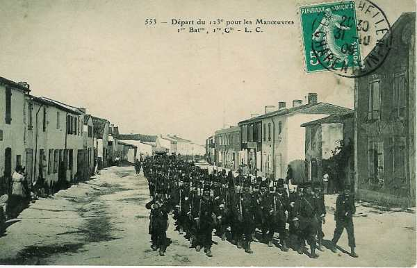

# Parcours du 123e R.I. (Saint-Martin de Ré)

En 1914, le régiment fait partie de la 69e brigade (général Durand), 39e division (général Excelmans) et 18e C.A. (général de Mas Latrie). Il est commandé par le colonel Hubert.

_123e régiment d’infanterie_
_Collection privée_

### 5 - 6 août :

Le régiment s’embarque en pour Bricon puis Barizey-la-Côte.

### 7 - 8 août :

Le 123e R.I. cantonne à Vannes-le-Châtel et à Allamps.

### 9 - 10 août :

Le régiment va cantonner à Bulligny, Bagneux et Allamps.

### 11 août :

Le régiment est réuni à hauteur de Thuilley-aux-Groseilles à 06h et constitue l’avant-garde de la division. Cantonnement à Pierreville, Puligny et Autrey.

### 12 août :

Le régiment quitte son cantonnement à 04h et marche par Xeuilley, Maron, Gondreville-sur-Moselle et bivouaque à l’ouest du fort de Villey-le-Sec.

### 13 août :

La division poursuit vers le nord par Gondreville, Villey-Saint-Etienne et Manoncourt en direction de Manonville. Le cantonnement a lieu à Manonville et Minorville.

### 14 - 15 août :

Le 18e C.A. est en réserve du groupe d’armées vers Manonville.

### 16 août :

Le 123e R.I. reçoit l’ordre de se préparer à s’embarquer à partir du 17.

### 17 août :

A 06h, le régiment quitte Manonville et est rejoint à Novéant par le bataillon qui avait cantonné à Minorville. Il arrive à Gironville à 12h30.

### 18 août :

Le régiment s’embarque à la gare de Sorcy.

### 19 août :

Le 1e échelon arrive à la gare régulatrice d’Hirson à 19h14 et à Fourmies à 21h. Il se met en route pour Trélon où il arrive le 20 août à 02h.

### 20 août :

Vers midi arrive à Trélon le 218e R.I. qui cantonne également dans la localité.

### 21 août :

Le régiment marche par Trélon, Liessies, Solre-le-Château, Hestrud où il cantonne en détachant deux bataillons vers Grandrieu (Belgique). Le régiment est couvert à sa gauche par la cavalerie anglaise.

### 22 - 23 août :

Le régiment reçoit l’ordre de partir à 20h vers le nord-est par l’itinéraire de Silenrieux, Walcourt, Chastres où la brigade est mise à disposition du 3e C.A.

Le régiment forme réserve et est placé au nord-ouest de Chastres à quelques centaines de mètres en arrière d’une crête. A 16h, les deux bataillons du 123e R.I. reçoivent l’ordre de se porter avec un groupe d’artillerie vers Morialmé.

### 24 août :

La bataille de Charleroi est perdue. Le régiment reçoit l’ordre de se replier par Vogenée sur Silenrieux où il arrive à 10h puis il cantonne à Silenrieux et à Boussu-lès-Walcourt où il reste jusqu’à 20h.

### 25 août :

Le régiment se replie par Erpion sur Fourbechies et marche toute la nuit. Il fait halte à Rance pour tenir l’entrée de la route de Chimay. La position est organisée avec des tranchées.

### 26 août :

Le 123e R.I. quitte sa position à 09h après s’être rendu compte qu’il était en flèche et il marche rapidement vers Salles. Il est inquiété entre Macon et Momignies par des patrouilles de uhlans et par l’impact de quelques obus.

### 27 août :

Le régiment se dirige vers La Bouteille par l’itinéraire Effry, Entre-Deux-Bois, Foigny. Il arrive à La Bouteille à 11h, puis reçoit l’ordre de couvrir ce village par le nord et le nord-est. Il cantonne à La Bouteille et Landouzy.

### 28 août :

La 123e R.I. tient La Bouteille pendant la matinée et quitte les tranchées à 11h pour se porter par Vervins sur Landifay.

### 29 août : bataille de Guise

Arrivé à Landifay à 04h, le régiment reçoit aussitôt l’ordre de se porter sur Mont d’Origny et de franchir les ponts à Origny et Mont d’Origny, pour aller se retrancher à droite du 6e C.A. sur les hauteurs de La Neuvillette.

A 14h, l’ordre parvient de tenter une attaque sur la ferme de  Jonqueuse, en liaison avec une attaque simultanée qui se produira sur la rive gauche de l’Oise. Le régiment franchit sous les obus le terrain entre les hauteurs de La Neuvillette et Bernot, franchit l’Oise sur une passerelle, puis se heurte à une falaise à pic gravie avec peine. Au sommet de la crête, les Français se trouvent en face d’une ligne allemande.

Vers 18h, le colonel donne l’ordre de repli. Il s’effectue sous la protection des mitrailleuses et du 3e bataillon vers Origny puis Landifay, où le régiment bivouaque.

### 30 août :

Le 3e bataillon et la 3e compagnie se dirigent vers La Ferté-Chevrésis. Ensuite parvient l’ordre de se replier vers Pleine-Selve. Les deux bataillons bivouaquent à Catillon. Le régiment a éprouvé des pertes : 400 tués ou blessés. Il fait à nouveau partie du 18e C.A.

### 31 août :

Le régiment quitte Catillon dans la matinée et passe l’après-midi à Aulnois-sous-Laon, d’où il repart à 20h.

### 1 septembre :

Le 123e R.I. cantonne à Paars.

### 2 septembre :

A 02h, le régiment repart par Nesles pour aller cantonner à Ronchères. Le 3e bataillon est arrêté à hauteur de Mareuil-en-Dôle par une canonnade qui crée un grand désordre.

### 3 septembre :

Départ à 06h. Le régiment au complet marche vers le sud et passe la Marne à Dormans Après un cantonnement à Baulnes, nouveau départ à 24h pour aller cantonner à Tréfols.

### 4 septembre :

Le 3e bataillon chargé de la protection du convoi est canonné à Rieu.

### 5 septembre :

Le régiment se rend à Boôlot et au château de Housay où il cantonne. Il doit s’organiser défensivement face au nord-est puis il reçoit l’ordre de prendre l’offensive le lendemain.

### 6 septembre : début de l’offensive

A 08h, le 123e R.I. se groupe au carrefour de la route de Villers-Saint-Georges à Montceau-lès-Provins, à hauteur du château de Flaix, encadré par le 6e R.I. et la 119e R.I. L’artillerie prépare l’attaque, surtout au moment où le régiment traverse Villers-Saint-Georges.

La nuit tombe et le régiment arrive devant Montceau. Le 1e bataillon pénètre dans le village et atteint les lisières face au nord.

### 7 septembre :

Dès la première heure, l’artillerie allemande prend une vigoureuse offensive et couvre d’obus la lisière nord de Montceau. Devant cette canonnade, le colonel du régiment fait rechercher un groupe d’artillerie qui prend position à 1200  ou 1500 m en arrière de Montceau.

La canonnade allemande redouble de violence et décime les défenseurs des tranchées. Les Allemands tentent un mouvement offensif sur le 1e bataillon. Dès que l’artillerie française entre en action, la situation change et l’artillerie et l’infanterie allemandes se taisent à partir de 11h.

A 16h, le régiment part en direction de Château-Thierry et bivouaque aux Bordes, sur la route de Reims à Paris.

### 8 septembre :

A 05h arrive un renfort de 500 réservistes.

### 9 septembre :

Marche rapide vers le nord à la poursuite des Allemands et cantonnement à Viffort.

### 10 septembre :

Départ de Viffort pour Château-Thierry où le régiment arrive vers 09h et en repart à 11h.

### 11 septembre :

Départ à 07h et arrivée à Mareuil-en Dôle à 20h.

### 12 septembre :

Départ à 06h et arrivée à 21h à Romain après être passé au pont de Breuil. Le régiment cantonne à Romain et à Ventelay.

### 13 septembre :

L’attaque est reprise à 03h par les 9e, 11e et 12e compagnies qui mettent la main sur un convoi allemand suffisant pour ravitailler la division. Arrivée à Pontavert à 12h, et départ de la localité à 17h pour arriver à 20h à la ferme du Temple.

### 14 septembre :

Le régiment reçoit l’ordre de se mettre en réserve d’armée à Ventelay puis, à 13h30, celui d’aller soutenir le 3e C.A. vers Beaurieux et enfin de se former en réserve près d’un bois au sud-est de Pontavert. Vers cette période commence la guerre de tranchées.