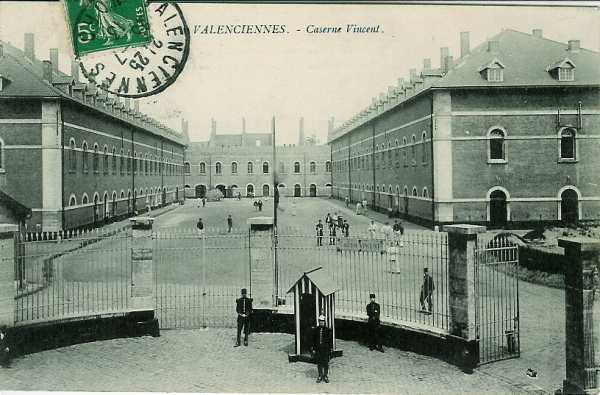
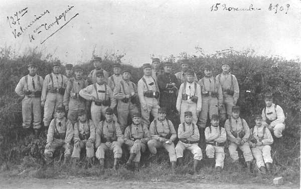

# Parcours du 127e R.I. (Valenciennes, Condé)

En 1914, le régiment fait partie de la 1e brigade, 1e division (général Gallet) et 1e C.A. (général Franchet d’Esperey). Il est commandé par le lieutenant-colonel de Fonclare.

_Valenciennes : caserne Vincent_
_Collection privée_

_127e R.I. 4e compagnie_
_Collection privée_

A la mobilisation, il compte 55 officiers et 3335 hommes, 45 chevaux de selle et 117 chevaux de trait.

### 5 août :

Le régiment se met en route en trois échelons vers Hannappes, Bossus-lès-Rumigny et Mont-Saint-Jean.

### 6 - 9 août :

Le régiment reste dans ses cantonnements à Rumigny.

### 10 août :

Le 127e R.I. se rend à Sécheval, Montcornet et Renwez.

### 11 - 12 août :

Les 2e et 3e bataillons rejoignent le 1e à Sécheval.

### 13 août :

Départ de Sécheval à 01h et cantonnement-bivouac à Montigny-sur-Meuse.

### 14 août :

Départ de Montigny-sur-Meuse et cantonnement à Gochenée et Vodelée.

### 15 août :

A 13h40, le régiment reçoit l’ordre de se rassembler à Morville et d’y organiser une position de repli. A 18h30, le 127e R.I. reçoit l’ordre d’aller cantonner à Anthée.

### 16 août :

Le régiment a l’ordre de se porter à la halte de Gérin (grand’ route Anthée - Onhaye) et quitte Anthée à 04h.

A 16h, je 127e reçoit l’ordre de garder le secteur Anhée - Houx et se dirige par conséquent sur Haut-le-Wastia par Weillen et Sommière, lieu de cantonnement.

### 17 août :

Le régiment quitte son cantonnement de Sommière à 03h et se rend à Gérin. Pour renforcer le centre de résistance Hastière - Lenne, le 127e R.I. reçoit l’ordre de se rendre à Maurenne. La 8e compagnie est détachée à Hastière-Lavaux et la 2e à Ermeton.

### 18 août :

A 04h, le régiment prend ses dispositions de défense :

- 7e et 8e compagnies à Hastière
  5e cie à Inzemont
  2e cie à Ermeton
  3e  cie à Maurenne
  3e bataillon à Anthée.

A 11h, le régiment rentre dans ses cantonnements à Maurenne, Ermeton, Hastière-Lavaux et Anthée.

### 19  - 21 août :

Le 3e bataillon cantonne à Miavoye.

### 22 août :

Le 127e R.I. quitte ses cantonnements à 02h, en se dirigeant vers Ermeton-sur-Biert et il cantonne à Denée.

### 23 août :

Le régiment reçoit l’ordre de s’établir près de Saint-Gérard. A 06h, l’attaque allemande se produit et vers 15h, les bataillons de première ligne reçoivent l’ordre de se replier par échelons successifs. Retraite sur Bioul et bivouac dans les bois de Denée.

### 24 août :

A 01h, le régiment marche vers le sud par des routes encombrées et cantonne à Matagne-la-Grande, qu’il quitte à 23h30, en poursuivant vers le sud.

### 25 août :

A 04h, le régiment doit barrer le couloir de Mariembourg. Les 1e et 3e bataillons sont en première ligne, le 2e en réserve.

A 09h, l’attaque allemande commence par une vive fusillade de la cavalerie, puis par des tirs d’artillerie. Le tir des mitrailleuses françaises semble efficace contre les colonnes d’infanterie qui sortent des bois.

Vers 16h, le régiment est avisé d’avoir à se préparer à se retirer, la mission de retardement étant remplie. Les derniers éléments se replient sur les hauteurs boisées de Nismes - Petigny d’où ils gagnent Couvin. Le régiment arrive à 23h30 à Cul-des-Sarts où il cantonne.

### 26 août :

Le régiment se porte sur Watigny où il cantonne.

### 27 août :

Le 127e R.I. poursuit sa marche et cantonne à Coingt.

### 28 août :

Le régiment cantonne à Cilly.

### 29 août : bataille de Guise

Le 127e R.I. se dirige vers Faucouzy et Montceau-Guise. Vers 10h, le 1e C.A. reçoit l’ordre de se porter vers Le Hérie-la Viéville - ferme de Bretagne. A 11h45, la 1e brigade reçoit l’ordre d’attaquer Le Hérie-la-Viéville. Le combat se poursuit une partie de la nuit et le 127e R.I. reste sur ses positions malgré un retour offensif des Allemands.

### 30 août :

A 03h, ordre est donné d’abandonner Clanlieu et de se replier sur Le Hérie-la-Viéville, puis un contre ordre est donné de reprendre Clanlieu. Les Allemands ne peuvent être délogés de leurs positions et les deux bataillons se replient vers Le Hérie-la-Viéville. Le soir, le régiment cantonne à Bois-lès-Pagny. La journée a coûté au régiment 4 tués et 68 blessés.

### 31 août :

Cantonnement à Gizy.

### 1 septembre :

Cantonnement à Meurival.

### 2 septembre :

Cantonnement à Lhéry.

### 3 septembre :

Le 127e R.I. traverse la Marne sur un pont de bateaux. Il cantonne à Ouilly et La Cense Carrée.

### 4 septembre :

Le colonel de Fonclare est nommé commandant de la 1e brigade et le commandement du régiment est repris par le colonel Boudhors. Le régiment cantonne à La Chapelle-sous-Orbais.

### 5 septembre :

Le dispositif est pris en vue d’une offensive le 6. Le régiment cantonne à La Paimbaudière.

### 6 septembre : début de l’offensive

La Ve armée prend l’offensive dans la direction générale de Montmirail. Le 1e C.A. attaque vers Les Essarts-le-Vicomte - Esternay - Champguyon - Montmirail.

Le 127e R.I. soutient le premier choc à Esternay et gagne du terrain pendant toute la journée.

### 7 septembre :

La marche en avant se poursuit. A 07h, les Allemands commencent à battre en retraite et le régiment cantonne à Rieux. Il a perdu 25 tués et 175 blessés.

### 8 septembre :

A 07h, la division se rassemble entre Fontaine-Armée et Maclaunay. Le régiment est à la disposition du général de division.

### 9 septembre :

Le 127e R.I. se porte vers Vauxchamps puis à l’attaque de Margny. Les Allemands provoquent une contre-attaque sur la droite.

A 17h30, le colonel Boudhors est blessé d’une balle au genou gauche et est remplacé par le commandant de Senpel. En soirée, le régiment cantonne à Fontaine-Chacun, après avoir perdu 11 tués et 74 blessés.

### 10 septembre :

Le 127e R.I. se dirige vers Dormans pour traverser la Marne.

### 11 septembre :

Le régiment passe la Marne sur un pont de bateaux pour se diriger ensuite vers Bas Verneuil, Verneuil, Trotte où la brigade est rassemblée. La marche est reprise vers Violaine et La Macquerelle.

### 12 septembre :

Le 127e R.I. se porte vers Pargny-lès-Reims et cantonne à Ornes.

### 13 septembre :

Le 127e R.I. reçoit l’ordre d’occuper les sorties nord et nord-est de Reims :

- 1e bataillon : faubourg de Vesle
  2e bataillon : La Neuvillette
  3e bataillon : Ferme de Pierquin

### 14 septembre :

A 09h, le 3e bataillon reçoit pour objectif l’attaque de la lisière nord du bois de Soulains et de la ferme Madelin.

Les Allemands opposent une résistance acharnée mais le 3e bataillon parvient à  la lisière nord du bois de Soulains. Dans la nuit du 14 au 15, le 127e R.I. est relevé par le 84e R.I. et reçoit l’ordre de cantonner à La Neuvillette.

### 15 - 16 septembre :

Le régiment doit organiser une position sur le front Pont de Neuvillette - ferme Pierquin.

### 17 septembre :

Le régiment est envoyé à Montigny-sur-Vesle puis vers la corne sud du bois de Gernicourt.

### 18 septembre :

A 17h, le régiment reçoit l’ordre d’occuper Gernicourt et le bois. A partir de cette période commence la guerre de positions.