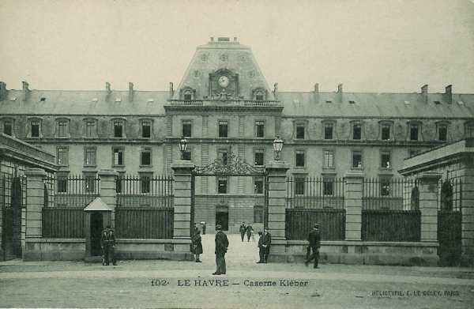
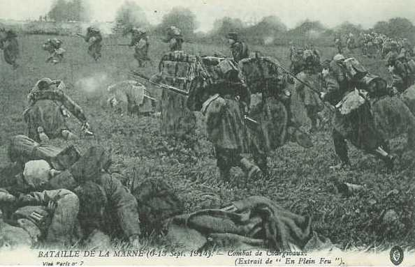

# Parcours du 129e R.I. (Le Havre)

En 1914, le régiment fait partie de la 10e brigade (général Lautier), 5e division (général Verrier) et 3e C.A. (général Sauret). Il est commandé par le colonel Salle.

A la mobilisation, il compte 3350 hommes et 172 chevaux.

_Le Havre : caserne Kléber_

### 6 - 7 août :

Le régiment s’embarque en chemin de fer.

### 7 - 8 août :

Le régiment débarque à Poix-Terron et va cantonner dans cette localité et à Villers-sur-le-Mont.

### 9 août :

Le 129e R.I. cantonne à Villers-sur-le-Mont et à Guignicourt.

### 10 - 14 août :

Cantonnement à Boulzicourt, Saint-Marceau et La Francheville.

### 15 août :

Le régiment se rend à Warcq (ouest de Charleville-Mézières).

### 16 août :

Cantonnement à Marby et à Blombay.

### 17 août :

Le 129e R.I. traverse la frontière belge et cantonne à Monceau - Imbrechies.

### 18 août :

Cantonnement à Fourbechies.

### 19 août :

Cantonnement à Somzée.

### 20 août :

Cantonnement à Gerpinnes.

### 21 août :

Le régiment arrive à 09h à Villers-Poterie. A 21h, il reçoit l’ordre d’envoyer le 3e bataillon à Les Binches, le 1e à Presles et le 2e sur la route de Châtelet, à la disposition du général de la 9e brigade.

### 22 août : Combats de Roselies et de Châtelet

**Combat de Roselies**

Le colonel du 129e R.I. reçoit l’ordre d’attaquer le village de Roselies  après une préparation d’artillerie. Les deux bataillons se déploient en tirailleurs à 800 m environ du village et se portent à l’attaque de la lisière sud, encadrés à l’est par le 74e et à l’ouest par le 25e.

La lisière du village est enlevée  et les deux bataillons pénètrent pour gagner la lisière nord, puis atteindre les ponts de la Sambre, mais ils se heurtent à des retranchements, des barricades et des maisons crénelées à l’intérieur du village, ce qui ne leur permet pas de progresser. En même temps, ils sont menacés sur le flanc droit par une ligne de tirailleurs et par des mitrailleuses installées sur un terril.

Après s’être battus environ une heure dans le village, les Français sont obligés de rétrograder jusqu’à l’abri de la cote 175. De là, ils gagnent Les Binches.

**Combat de châtelet**

Le 2e bataillon est mis à la disposition du général de la 9e brigade et prend part à l’assaut sur Châtelet et Bouffioulx, puis il est entraîné dans la retraite de la 9e brigade.

Au cours de ces combats, le régiment a perdu 58 tués, 567 blessés et 50 disparus.

Vers 16h, le régiment se rassemble entre Villers-Poteries et Gerpinnes. A 17h, il se porte sur Hanzinne, puis Hanzinelle où il bivouaque.

### 23 août :

Le 129e R.I. met Hanzinelle en état de défense. Dès 15h, le village est soumis à un bombardement d’obusiers.

### 24 août :

La 5e division bat en retraite vers le sud. Le 129e R.I., formant l’arrière-garde, fait route par Morialmé et Fraire et prend position sur la croupe 279 avec une batterie pour arrêter la poursuite des Allemands.

Vers 13h, le régiment reçoit l’ordre de reprendre la marche et de rejoindre la 5e division par Yves-Gomezée, Daussois, Silenrieux et Boussu-lès-Walcourt.

A 17h, le régiment passe par Erpion et va s’établir en bivouac à Sautain.

### 25 août :

La retraite se poursuit par Eppe-Sauvage, Moustier-en-Fagne, Baives, Macon. Le régiment prend une position de défense vers Macon mais la marche doit reprendre vers 17h par Baudet et Ohain.

### 26 août :

La 10e brigade occupe dès 06h une position défensive vers Rocquigny. A 13h, le 129e R.I. reçoit l’ordre de se porter dans le bois de Montreuil et de le mettre en état de défense.

### 27 août :

A 02h, le régiment reçoit l’ordre de quitter le bois de Montreuil et de se porter à La Capelle. Il forme l’arrière-garde et vient, par Sommeron, Gergny, Etreaupont, prendre position à la Cense-Carrée, où la 10e brigade couvre le repli de la 5e division sur Vervins.

A 17h, la 10e brigade reçoit l’ordre de quitter la Cense Carrée et d’aller occuper Gercy, 2 km au sud-ouest de Vervins.

### 28 août :

La 5e division se porte dans la direction de Guise. Le 129e R.I. forme l’avant-garde. Il part à 05h en suivant l’itinéraire Saint-Gobert, Voharies, Berlancourt, La Neuville-Houssaye, Richaumont, Puisieux. L’avant-garde reçoit l’ordre de prendre position en occupant la lisière nord de Puisieux et le village d’Audigny. Une compagnie est détachée à Colonfay.

Le 1e bataillon s’engage à Audigny et le 3e vers Puisieux. A la tombée du jour, le 129e R.I. occupe Audigny et la ferme de l’Etang.

### 29 août : bataille de Guise

**Combat de Landifay**

La 5e division reçoit l’ordre de se rassembler vers la ferme de Bertaignemont sous la protection du 36e R.I., porté entre cette ferme et Origny. Le 129e R.I. trouve la ferme de Bertaignemont occupée et l’attaque avec deux bataillons pendant que le 3e arrête les progrès allemands à Audigny.

La seconde attaque sur Bertaignemont réussit mais le régiment ne peut se maintenir sous les feux croisés de l’artillerie allemande et doit rétrograder vers le village de Landifay. Le bataillon d’Audigny, après avoir défendu le village jusqu’à la dernière extrémité, se retire dans la direction de Marle.

Les pertes ont été de 66 tués, 490 blessés et 150 disparus.

### 30 août :

Après avoir tenté une nouvelle attaque sur la ferme de Bertaignemont, la 5e division se replie dans la direction de Laon. En soirée, le régiment cantonne à Montigny.

### 31 août - 1e septembre :

La retraite continue. Le régiment passe par Vailly, Baslieux-lès-Fismes où il cantonne. Il reçoit un renfort de 1015 hommes en provenance du dépôt.

### 2 septembre :

La 5e division se porte au sud du ruisseau de l’Autron, par Courlandon, Unchair et Crugny. Le 129e R.I. va cantonner à Lagery et Aougny.

### 3 septembre :

Le régiment traverse la Marne où la 5e division prend position. Il passe par Romigny, Alizy et Violaine, Châtillon-sur-Marne, Port-à-Binson et cantonne à Mareuil-le-Port.

### 4 septembre :

Les Allemands franchissent la Marne à Port-à-Binson et à Troissy. La 5e division reprend son mouvement de retraite vers le sud par Le Vivier, Igny-le-Jard, Bièvres et Fromentières, où le 129e R.I. bivouaque.

### 5 septembre :

La 5e division continue son mouvement de retraite par Le Thoult, Rosnay, Le Bout-du-Val, Le Recoude, Châtillon-sur-Morin, Les Essarts-le-Vicomte, Bouchy-le-Repos, Saint-Genest où le régiment s’établit en cantonnement d’alerte.

### 6 septembre : début de l’offensive

La Ve armée se porte vers le nord. La 10e brigade marche, par La Sourcière et le bois de la cote 209, sur Courgivaux, la 9e brigade sur Escardes.

Le 1e bataillon du 129e R.I. s’engage à Courgivaux, entre dans le village avec des éléments du 74e, mais est rejeté à la fin de la journée par une contre-attaque allemande. Il se maintient à 300 m au sud du village. Le 3e bataillon contribue à repousser les attaques allemandes sur Escardes. Le soir, le régiment bivouaque au sud de Courgivaux et vers Escardes.

### 7 septembre : combat de Courgivaux

_Combat de Courgivaux_
_Collection privée_

Le 1e bataillon reprend l’attaque au point du jour sur Courgivaux. Le village, débordé à l’est par la 9e brigade et à l’ouest par la 36e, tombe en fin de journée. Le 129e R.I. se porte au Bois des Prés.

A 18h, le régiment reçoit l’ordre de se remettre en route et il va bivouaquer à Tréfols. Le combat a coûté 45 tués, 290 blessés et 50 disparus.

### 8 septembre :

La 5e division se porte à l’attaque de Montmirail par Morsains, Leuze, Fontaine-Armée, Les Canots, La Chaussée. Le régiment bivouaque dans les bois au nord de La Chaussée.

### 9 septembre :

Le 129e R.I. forme l’avant-garde de la 10e brigade. Il traverse la partie sud de Montmirail sans coup férir. La division suit alors la route vers Corrobert et Verdon. Le régiment cantonne dans les bois de Breuil.

### 10 septembre :

La 10e brigade se porte vers le pont de Savigny sur la Marne, pendant que la 9e se porte sur ce front par Condé-en-Brie.

### 11 septembre :

La 5e division poursuit son offensive, la 10e brigade par Passy-Grigny, la ferme du Temple, Aougny, où le 129e R.I. cantonne.

### 12 septembre :

Le 129e R.I. doit se porter sur Léry où il entre dans la colonne de la 5e division qui part par Poilly, Prévecy et Gueux. Il se porte ensuite sur Thillois. Les Allemands tentent de résister sur la ligne Garenne-de-Gueux - Thillois. La 90e brigade s’engage, enlève Thillois et Champigny. La 10e brigade s’établit en cantonnement d’alerte à l’est de Gueux.

### 13 septembre :

L’offensive de la 5e division se poursuit par Maco, Merfy, Saint-Thierry, Courcy et Brimont. Le 129e R.I. forme l’avant-garde de la division. Le bataillon de tête gagne la RN 44 puis Coucy, en essuyant le feu d’une artillerie en position vers Brimont. Au débouché de Courcy, il est accueilli par une fusillade partie du bois de Brimont. Il traverse vivement les ponts, occupe la gare, La Verrerie et les maisons adjacentes mais ne peut en déboucher car l’endroit est battu par des feux d’artillerie et d’infanterie.

Le 1e bataillon est appelé sur la rive nord du canal pour prêter secours au bataillon de tête. Pendant ce temps, le dernier bataillon du régiment occupe Courcy et détache une compagnie pour occuper le pont de l’écluse à 800 m au nord de Courcy.

En soirée, la situation est la suivante :

- Le 1e bataillon occupe les ponts, les maisons adjacentes à La Verrerie et la station
  Le 3e bataillon occupe La Verrerie où il se retranche
  Le 2e bataillon occupe Courcy et met en état de défense la lisière est du village.
  Une compagnie se trouve au pont de l’écluse.

### 14 septembre :

Le 129e R.I. se maintient à La Verrerie et à Courcy sous un violent bombardement. Le 129e et le 36e R.I., qui occupent les bois de Soulains, reçoivent l’ordre de faire occuper le château de Brimont, chacun par un bataillon. Le 1e bataillon du 129e R.I. est désigné mais le terrain entre La Verrerie et le château est pris d’enfilade par une fusillade qui part de la lisière sud des bois de Brimont.

### 15 septembre :

Vers 02h, le 1e bataillon du 129e R.I. gagne le château de Brimont en passant derrière le remblai de chemin de fer et les fourrés qui bordent le canal.

### 16 septembre :

Vers 17h, les Allemands tentent une violente attaque sur La Verrerie, la station et les ponts. Cette attaque est repoussée mais toute communication avec le château de Brimont par le bois de Soulains devient impossible. Il semble que le 1e bataillon au château de Brimont soit encerclé et ait déposé les armes.

### 17 septembre :

La position est soumise à un bombardement des plus violents Les deux bataillons du 129e R.I. peuvent toutefois se maintenir, au prix de 19 tués et 377 blessés.

### Nuit du 17 au 18 septembre :

A 02h, le 39e R.I. débouche de Coucy pour relever au pont et à la Verrerie les deux bataillons du 129e R.I. qui sont épuisés par les combats. Au moment où le régiment débouche des ponts, une attaque de nuit se produit par la route de Brimont, par le chemin de fer et la rive nord du canal.

L’attaque allemande sur La Verrerie réussit et les éléments du 129e R.I. se replient vers Coucy. Ce dernier village est également abandonné. Le régiment se reconstitue et passe à l’attaque de Courcy, mais la retraite du 39e R.I. entraîne celle du 129e. Le régiment, réduit à deux bataillons, est dirigé vers Saint-Thierry.
Il a perdu 25 tués, 75 blessés et 1000 disparus.

Le régiment reçoit un nouveau renfort de 497 hommes, ce qui porte les renforts totaux à 50 % de son effectif ! Par la suite, le combat va s’enliser dans une guerre de tranchées.