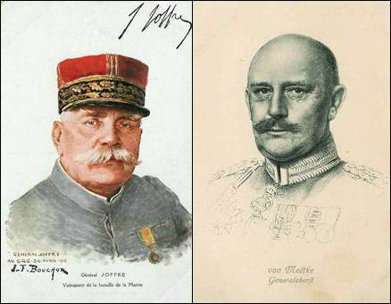

# La phase "guerre de mouvement" d'août à novembre 1914

Ce site est l’oeuvre d’un particulier et est consacré aux opérations militaires qui se sont déroulées d’août à novembre 1914, dans la phase dite "guerre de mouvement".

_Les deux adversaires : Joffre et Moltke_
_Collection privée_

L’histoire de la bataille des frontières, de la retraite à travers la Belgique et le Nord de la France et de la bataille de la Marne est l’exemple du redressement spectaculaire d’une situation presque compromise. L’Allemagne avait mis au point un plan longuement élaboré et théoriquement imparable pour battre rapidement l’armée française. Ses troupes possédaient une supériorité en armement, surtout en artillerie, une tactique tenant compte des effets dévastateurs des nouveaux armements. Elle avait constitué une masse de manoeuvre obligeant l’aile gauche franco-britannique à lutter presque à un contre deux.

Et pourtant, ce plan s’effondra au bout d’un mois après une série ininterrompue de succès, d’où l’on peut se poser les questions :

**A qui revient le mérite de la victoire de la Marne ?**
**Qui est responsable de l’échec du plan Moltke ?**

Après avoir présenté les causes qui ont déclenché la tragédie de la guerre de 1914 - 1918 et les deux plans, français et allemand, nous en verrons le déroulement au jour le jour, avec les succès et les échecs respectifs.

### Abréviations

| Abréviation | Dénomination                                                     |
| ----------- | ---------------------------------------------------------------- |
| B.E.F.      | British expeditionary force ou corps expéditionnaire britannique |
| C.A.        | corps d’armée = 40.000 hommes                                    |
| C.A.R.      | corps d’armée de réserve                                         |
| C.C.        | corps de cavalerie                                               |
| D.A.        | division d’armée belge                                           |
| D.C.        | division de cavalerie = 5.573 hommes                             |
| D.I.        | division d’infanterie = 16.000 hommes                            |
| D.R.        | division de réserve                                              |
| E.M.        | Etat-Major                                                       |
| G.D.R.      | groupement de divisions de réserve                               |
| G.Q.G.      | grand quartier général français                                  |
| O.H.L.      | Obere heeresleitung (grand quartier général allemand)            |
| P.C.        | poste de commandement                                            |
| R.A.        | régiment d’artillerie                                            |
| R.A.C.      | régiment d’artillerie de campagne                                |
| R.I.        | régiment d’infanterie = +- 3.400 hommes                          |
| R.I.C.      | régiment d’infanterie coloniale                                  |
| R.I.T.      | régiment d’infanterie territorial français                       |
